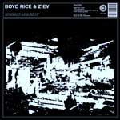
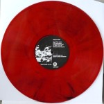

artist: **Boyd Rice & Z'EV** release: _Boyd Rice & Z'EV_ format: 12" year of release: 2008 label: [Cold Spring](http://www.coldspring.co.uk/) duration: 24:17

detailed info: [discogs.com](http://www.discogs.com/Boyd-Rice-ZEV-Untitled/release/1451090)

When two industrial legends like **Z'ev** and **Boyd Rice** get together, expectations tend to be high, and mine were no exception when I saw this record in the shop. The presentation was no joke either: Cold Spring went stylish for this ltd. x 1000 release, a marbled clear red 12" in a black sleeve with artworks by the musicians themselves.

It's too bad then that the music was a tad disappointing. In my naivité I expected Boyd delivering his usual spoken messages over an industrial percussive soundtrack, or something of the like, but this EP is filled with, well, noise. Not that there's anything wrong with noise, mind you. As we know, these are two men who know how to dish out earsplitting sounds, and the soundscapes on this record are - if not exactly pain-inducing - quite abrasive. One can vaguely hear the metal percussive elements, but most of it is warped and distorted to a degree that sound sources are hard to discern. It'll be a tough job to pick out Rice's supposed vocal contributions from this swirling mass of sound, for example. As a whole, the music sounds similar to **Z'ev**'s other recent offerings, like _Sum Things_, though a bit more intense perhaps.

Despite being a decent noise record, I found this collaboration to be a bit underwhelming, at least in terms of musical content. The presentation is pristine, however, so this item will be of interest mainly to true collectors of these artists and/or vinyl fanatics.

Reviewed by **O.S.**

Tracklist:

45 rpm Side: A. **Z'EV & Boyd Rice** - Untitled (8:09)

33 rpm Side: B. **Boyd Rice & Z'EV** - Untitled (16:08)
