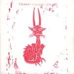

artist: **The Gray Field Recordings** release: _The Weaver's Daughter_ format: CD-R year of release: 2009 label: [AntiClock](http://www.anticlock.net/) duration: 34:09

detailed info: [discogs.com](http://www.discogs.com/Gray-Field-Recordings-The-Weavers-Daughter/release/1851619).

After quite a long wait, we were presented with the latest album by the American experimental folk project **The Gray Field Recordings**, the brainchild of R. Loftiss. It was well worth the wait, I may add, for _The Weaver's Daughter_ is a gorgeous album, every bit as estrangingly beautiful as its predecessor _Hypnagogia_, but with perhaps even more refinement.

The basic sound hasn't changed all that much: haunting acoustic melodies, noises, industrial sound effects, violin by **Justin Jones** on a couple of tracks, and over it all R.'s soft whispers and vocals, telling stories of hurt, lost memories, and dreams. At least, that's how the feeling I get when listening to these tracks, where the soft voices blend in with the music to create the unique atmosphere I was already so enthusiastic about concerning the last album. Like ghosts wreaking havoc in the kitchen of your derelict countryside home while grandma is singing a ballad on the porch. And beyond, because I would certainly not want to give the false impression that this music is after some cheap horror effect. Rather, it manages to tap into those hidden dreams and fears we'd rather not face, but also the melancholic beauty of knowing they are part of life and cannot be escaped.

I'm waxing lyrical again, which tends to happen with albums of a certain quality level. _The Weaver's Daughter_ is short but (bitter)sweet, and one of this year's essential releases in experimental folk and ambient. It's packaged in a handstamped gatefold, tied up with string and wax-sealed, in an edition of 100 copies, so get it while you can. You're not likely to regret it.

Reviewed by **O.S.**

Tracklist:

I. The Weaver's Daughter (5:02) II. Milky White (2:48) III. In Milky Twilight (4:46) IV. Petricore And Lullaby (3:51) V. Transmissions From The Terminal (2:30) VI. Tiny Music (5:06) VII. From Sheneland (5:39) VIII. Abhadda Kedhabhra (4:27)
