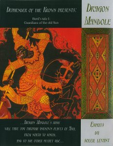

artist: **Dragon Mandole** release: _Bard's Tale I: Esprits du Soleil Levant_ format: CDr year: 2009 label: [Self-released](http://www.myspace.com/oeildelune) duration: 79:49

detailed info: [discogs.com](http://www.discogs.com/Dragon-Mandole-Bards-Tale-I-Esprits-Du-Soleil-Levant/release/1917520).

**Dragon Mandole** is a solo project by the Breton musician Padrigh. Utilising an arsenal of acoustic folk instruments he creates music that takes the listener away to far oriental atmospheres.

The basic elements of these songs are guitars, mandolins, flute, and percussion. With these, Padrigh creates long, soundscape-like tracks, but with a strong rhythm and repeating melodies. Chanted vocals feature prominently on many of the tracks, and the sound of the guitars is sometimes thickened with distortion to lend the tracks a heavier touch.

As we can see from the finely laid-out fold-out packaging, **Dragon Mandole** is inspired by East-Asian and Middle-American culture, ranging from history to folklore, and even to modern video games ([_Ico_](http://en.wikipedia.org/wiki/Ico)) and anime. This gives the album a very personal touch, as it manages to express the way in which oriental and occidental culture can merge in the mind of a young Breton. As can be expected, many of the themes and melodies are distinctly Asian, but the overall effect reflects the uniqueness of this mix of cultures.

A point of criticism might be that the composition and sound shows a bit too little variation for such a long album. Apart from that, this is a beautiful home production with tons of epic folk atmospheres, nice extensive liner notes, and excellent sound. Recommended for experimental folk lovers and even game soundtrack enthusiasts!

Reviewed by **O.S.**

**Tracklist:**

**\[ Part I: Snowing On The Sea \]**

1\. The Castle Of Ico (8:30) 2. Hajime-kun Cosmofantasy (10:36) 3. Memories Of Ico (6:35)

**\[ Part II: Lan-Na And Lan-Xang \]**

4\. Interlude ( 1:29) 5. La Pluie Des Petits Noï (1:25) 6. La Route Des Xangs (9:09) 7. Nam San River (2:56) 8. Le Palais De La Forêt (4:19)

**\[ Part III: Songs Of The Wild Grass \]**

9\. Horses In The Morning (7:45) 10. Ixtaccihuatl (6:46) 11. En Suivant La Rivière (20:09)
