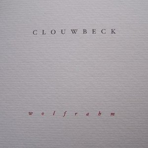
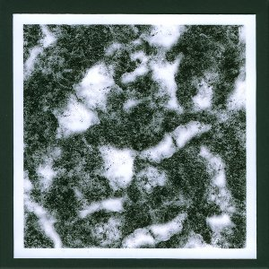
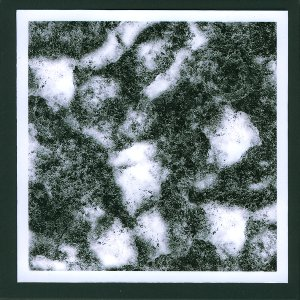
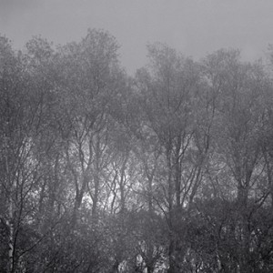

2009 has been a productive year for English artist and musician **Richard Skelton**. I've been following his work for over two years and am still amazed by his unique style and approach to music. It combines an open mentality towards the British countryside and history with layered, melancholic acoustic music, flowing and ambient.

In this post, I'll give a brief overview of some of his recent releases that I found particularly inspiring.

Richard releases his music under different monikers, each corresponding to subtle differences in instrumentation and composition. **Clouwbeck**, for example, seems to be mostly about music written for bowed string instruments. This was clear in the project's first release, [_A Moraine_](http://www.eveningoflight.nl/en/reviews/clouw_moraine.htm) (2007), but again in this year's _Wolfrahm_, released on the Polish label [**Shining Day**](http://www.shiningday.pl/).

\[caption id="attachment\_609" align="aligncenter" width="150" caption="Clouwbeck - Wolfrahm (CD, 2009)"\]\[/caption\]

Its six tracks flow gently, reaching different levels of intensity, and touching upon various emotions along the way. The minimalistic packaging is suitable and stylish, though perhaps a bit bland compared to the loving packaging of Richard's own releases on [**Sustain-Release**](http://www.sustain-release.co.uk/).

Another release this year was the EP _Tide of Bells & The Sea_ by **Heidika**, the project that constituted the first **Sustain-Release** outing in June 2005. I haven't heard that original recording, so I can't comment on how this new one compares to it, but by itself, the EP is a fascinating piece of work.

\[caption id="attachment\_611" align="aligncenter" width="150" caption="Heidika - Tide of Bells & The Sea (CDr, 2007)"\]\[/caption\]

Richard described it as one of his most electronic works, but that should be interpreted in context. I assume some electronic editing and warping most have taken place, but the final result is still quite organic and exudes a mystical atmosphere. A softly pulsating acoustic drone forms the background of this one 18+ minute track, which evokes images of the twilit hours before dawn, when the day comes to life. Like many of the releases on Richard's own label, this one was produced in small individual runs with differing artwork; the original release date was set late in 2007, but it might still be available in some version or other.

Another 'old' project getting a new release was **Carousell,** with the beautiful album _Black Swallow & Other Songs_. This, too, was released in a limited edition on **Sustain-Release**. It is more song and melody-oriented than most of Richard's other works, though never compromising on the style or atmosphere.

\[caption id="attachment\_612" align="aligncenter" width="150" caption="Caroussell - Black Swallow & Other Songs (CDr, 2009)"\]\[/caption\]

It proves that the instrumentation and approach that is general to all of Richard's works also works when the compositions are less ambient and more to the point. The use of some field recordings (church bells) and the addition of wordless female vocals by **Autumn Grieve** on the final track further improve on the diversity of this album.

Perhaps the most beautiful of all Richard's recent releases is _Marking Time_, the first to be released under his own name. It was released on CD by the Australian [**Preservation Records**](http://www.preservation.com.au/) in 2008. I missed out on that version as I believe it sold out rather quickly. This year, however, it was rereleased on vinyl by **[Type Records](http://typerecords.com/)**, a wonderful decision. That's the version I eventually purchased (also sold out now, though) and have grown to love.

\[caption id="attachment\_614" align="aligncenter" width="150" caption="Richard Skelton - Marking Time (LP, 2009)"\]\[/caption\]

The album's seven tracks basically showcase many of Richard's different sides. Some tracks, like the impressive "Brook" and the heartbreaking "Fold" focus on bowed string melodies, while other tracks utilise guitar and harp pickings, piano, and other sounds. Throughout all the tracks, Richard's unique artistic perspective is represented, the ability to instil human emotions into a natural landscape, and expressing that through sound. All of his releases feature this element to some degree, but _Marking Time_ is arguably one of the best. Highly recommended, and definitely worth looking up, even if you have to go second-hand.

These weren't the only new releases from Skelton recently. Mention needs to go out to the following: the LP/CD reworking of [**A Broken Consort**'s _Box of Birch_](http://www.tompkinssq.com/broken_consort.html) on **Tompkins Square Records** (2009); Also by **A Broken Consort**: the second part of _Crow Autumn_ on **Sustain-Release**; Finally, Richard contributed to the latest EP by aforementioned **Autumn Grieve**, [_Stray Birds_](http://www.eveningoflight.nl/2010/02/23/review-autumn-grieve-stray-birds-2009/), which has by now seen a couple of editions and comes highly recommended to lovers of ambient folk with moody female vocals. It's been released on [**Corbel Stone Press**](http://www.corbelstonepress.com/), the joint label of these two artists.

Last but not least, keep your eye out for news concerning Richard's project **Landings**, where he combines music, text and brilliant photography. I've harvested most of the material from when **Landings** was a blog, and taken together it's a great gesamtkunstwerk, wonderfully documenting some of Richard's forays into the British landscape and history. The blog's been taken offline since, but there has been a very limited release in book form, hopefully to be continued or repressed some time soon.
