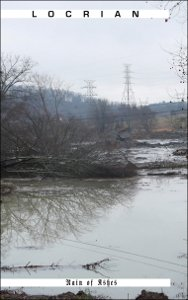

artist: **Locrian** title: _Rain of Ashes_ format: MC year of release: 2009 label: [Fan Death](http://www.fandeathrecords.com/) duration: 29:55 (x2)

detailed info: [discogs.com](http://www.discogs.com/Locrian-Rain-Of-Ashes/release/1904192)

The American drone duo **Locrian** (consisting of **André Foisy** and **Terence Hannum**) have been very productive in their few years of existence as a band, releasing an impressive number of releases on various formats and labels. If this tape, which is one of their latest, is any indication of the level of quality of the other recordings, it will be an essential discography to check out for guitar drone lovers.

_Rain of Ashes_ is a single composition of a little under thirty minutes, for guitar, keys, and vocals, threading through different parts and atmospheres: ambient, ominous, intense, overwhelming. The development of the song is outstanding: it builds up gradually from pure high-pitched guitar wailings to something more dense and layered, and beyond. There are easily enough different parts in the composition to rule out boredom and repetition, a pitfall that plagues so many other drone artists. Over the course of _Rain of Ashes_, we also find some gentle organ parts, slow guitar parts with various effects, and a climax of all-out noise with distorted vocals and guitar.

Another nice touch is the B-side, which is actually the same composition but played in exact reverse. This adds a ghostly touch to many of the reverberating parts, besides being a fun experiment to put on a low-price tape like this. It also emphasises the strength of the composition, as I don't mind listening to it twice in a row at all. Together, the two halves of the tape offer an hour of great music with a dark atmosphere of urban decay and fallen industry.

All in all, a very succesful tape release that's easily worth its price. I'm not sure how limited it is, but I guess it's still available, so go get it if you enjoy rough-edged drone music with highly varied compositions.

Reviewed by **O.S.**

Tracklist:

A. Rain Of Ashes (29:55)

B. sehsA fO niaR (29:55)

<table border="0"><tbody><tr class="first"><td class="track_pos">A1</td><td></td><td class="track_title">Rain Of Ashes</td><td class="track_duration">29:55</td><td class="track_itunes"></td></tr><tr><td class="track_pos">B1</td><td></td><td class="track_title">Sehsa Fo Niar</td><td class="track_duration">29:55</td></tr></tbody></table>
