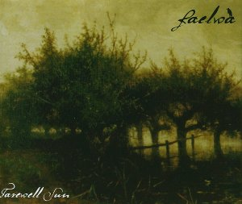

artist: **Faelwa** release: _Farewell Sun_ format: CDr year of release: 2009 label: [Self-released](http://www.faelwa.com) duration: 19:10

Introducing a promising new Dutch project is always a pleasure to me, so I'm glad I can present **Faelwa** to you. This band is a duo consisting of Mark Kwint and Jasper Strik, who hail from the Eastern part of the Netherlands. The music they play is instantly recognisable as the kind of romantic neofolk that has its roots in metal, and that we know from bands like **Empyrium**.

Interestingly enough, this EP starts with what I consider the weakest track, "The Heron". Like the title track on this release, it is a song based on piano, guitar, and drums, strongly reminiscent of early **Tenhi** in the way neofolk and progressive rock are fused. The title track, however, is just a bit more refined and original. In between we find the marvellous "Wilgenwind", which is easily good enough to come straight off an **Empyrium** or **Vàli** album; a lovely piece for piano and guitar/bouzouki. The closing track is "Orphan Lullaby", a calm, soothing composition dominated by a sweet dual piano/guitar melody.

Let me get this out of the way: _Farewell Sun_ isn't a thoroughly original release, and the sound of inspiring artists - especially **Tenhi** - is found throughout. It is clear that **Faelwa** is a young project still in search of its own voice. However, this EP is an excellent first work, lovingly produced and played. It is one of those hugely important first steps for a band, and in this case, it's a very successful one. Therefore, if you enjoy dark acoustic music from this particular end of the spectrum, do these men a favour and support their development by purchasing this lovely and promising EP.

Reviewed by **O.S.**

Tracklist:

1\. The Heron (4:22) 2. Wilgenwind (2:14) 3. Farewell Sun (7:44) 4. Orphan Lullaby (4:50)
