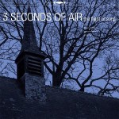

artist: **3 Seconds of Air** release: _The Flight of Song_ format: CD, LP year of release: 2009 label: [tonefloat](http://www.crazy-diamond.nl/tonefloat/) duration: 74:25

detailed info: [discogs.com](http://www.discogs.com/3-Seconds-Of-Air-The-Flight-Of-Song/master/136501).

Released in June 2009, this debut album by **3 Seconds of Air** is a new addition to the roster of **tonefloat** records. On second thought, new... who other than **Dirk Serries** (**vidnaObmana**, **Fear Falls Burning**) would be one of the members of this trio? Together with bassist **Martina Verhoeven** and guitarist **Paul van den Berg**, he's embarked on a new musical journey. _The Flight of Song_ was recorded live last February in a frozen-over Flemish chapel, using two Gibson Les Pauls and a Fender Jazz Bass, some effects, amps, a mic, and a laptop. Sounds like a recipe for some heavy guitar drones, but that's not quite the case.

No, _The Flight of Song_ is more like the exact opposite: light and flighty sounds in long, drifting compositions. In fact, the band name is perfectly chosen, provided you extend the time period a bit. From start to finish, these three musicians pick you up into a soaring, bright atmosphere, and they don't put you down until the last notes fade after over an hour. Most of the floating power, so to speak, is provided by gentle guitar waves, with the bass picking out a note here and there. Very slow, very minimal, like a much lighter counterpart to **Bohren & Der Club of Gore**.

I get the feeling that when the band came to recording the final result, they had grown perfectly attuned to their surroundings and each other's music; they never get in each other's way, the sound is delicate and well-designed, and in a way, we're listening to a record meditation session expressed not in words or song, but in soft drones and waves. The one problem that I have with this though, is the following. This might be one of those cases where the result, however charming, is infinitely less important to the listener than to the maker. For me, the atmosphere and flow of the album is perfect, but in essence, it never transcends the level of excellent background music, because the experience of being part of this meditation is absent. I imagine this must have been different for those who had the chance to attend of the band's performances this summer. In the end, though, this is purely subjective, and I encourage others to judge for themselves if they can find something tucked away in these musical cloudscapes.

Reviewed by **O.S.**

Tracklist:

1\. Dead Poets Sing The Sunless Land (20:03) 2. The Heart Disintegrates Wearing Disposable Masks Of Angels (22:44) 3. Warping Night Air Having Brought The Boom (18:19) 4. Ghosts Stream The Harmony Of Delight (13:19)
