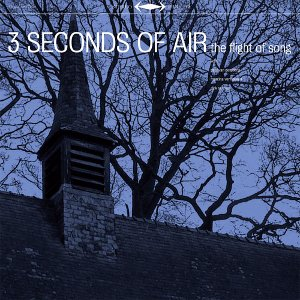

artist: **Troum** release: _Eald-Ge-Stréon_ format: 2xCD year of release: 2009 label: [Beta-lactam Ring](http://www.blrrecords.com/) duration: 1:32:18

detailed info: [discogs.com](http://www.discogs.com/Troum-Eald-Ge-Str%C3%A9on-Abhij%C5%88%C3%A2/release/1725016)

If there are any artists in the realm of drone music that have left a lasting impression on me during the past few years, **Troum** surely are among them. The German duo consisting of Glit\[S\]ch and Baraka\[H\] (both previously part of **Maeror Tri**) have done so not only through a breath-taking live performance a couple of years ago, but also through their recent releases, such as [_AIWS_](http://www.eveningoflight.nl/2007/09/01/review-troum-aiws-2007/) and their collaboration with **Martyn Bates** on [_To a Child Dancing in the Wind_](http://www.eveningoflight.nl/2007/03/01/review-martyn-bates-troum-to-a-child-dancing-in-the-wind-2006/). When the first notes of "Elation" hit me when listening to the samples of this latest release, I knew we were in for something special once more.

According to the liner notes, this album is a collection of oddities, presented almost apologetically as a loose collection of tracks that were used before, sometimes in live performances, reworked and remodeled. As a bonus, we get a second CD, _Abhijñâ_, which contains another 30+ minute new composition. However, when a 'mere' archival compilation is as tightly put together as _Eald-Ge-Stréon_, it doesn't truly matter where the material comes from; the result is a rock-solid album of rhythmic drone music.

As that last typification suggests, rhythm is one of the factors that makes this album so gripping. Whether we are dealing with pure waves of sound - as in the truly moving opening track or the serene "Eolet" - or rather the more concrete percussion of "Usque Sumus Lux" or the brilliant **Savage Republic** cover "Procession", rhythms and pulsations power this album, giving it a forward-moving (or spiraling) force that is usually not achieved by more minimalistic drone and ambient artists. Like I've said earlier, it's remarkable how coherent the sound on this album is, considering the diverse origins of the tracks themselves. Each track seems to have received a great deal of attention in order to make the perfect fit, which has its effect on the listening experience: entering _Eald-Ge-Stréon_ is like drifting into a special world where sound forms epic cloudscapes, sirens' songs, and ritual journeys.

Added to the power of processed sound, there is always the visual and linguistic element prominent in **Troum**'s work. To start with the latter, words from places distant in time and space are always present (Old English and Sanskrit album titles in the case of this double album, among other things), giving other parts of your brain to work on something as well. Perhaps my suspicion that at least one of **Troum**'s members is a professional linguist is founded? Either that, or they simply have a knack for picking thought-provoking words for their track titles. The visual side of this release is handled by **Stephen O'Malley**, resulting in a glitzy, almost too slick, design and packaging. It combines quite well with the excellent glossy (and sturdy!) sleeves used by the record label, but it's perhaps a bit too artificial compared to the organic, almost muddled flow of the music.

Time to cut a long story short: _Eald-Ge-Stréon_ is a superb work, definitely one of **Troum**'s best albums so far, and certainly one of the most important drone albums of the year. The original 2CD edition is limited to 500 copies, but a 2LP version is due in mid-November 2009. Ample opportunity to lay your hands on this masterpiece, in other words.

Reviewed by **O.S.**

**Tracklist:**

_Eald-Ge-Stréon_

1-1 Elation (7:09) 1-2 Usque Sumus Lux (8:18) 1-3 Eolet (7:53) 1-4 Ecstatic Forlorness (9:40) 1-5 Dhânu-H (4:41) 1-6 Procession (4:39) 1-7 Crescere (16:28)

_Abhijñâ_

2-1 Abhijñâ (33:30)
