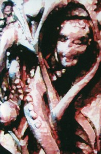

artist: **Sedayne** release: _Naked Season_ format: MC year of release: 2009 label: [Sloow Tapes](http://sloowtapes.blogspot.com/) duration: 58:01

detailed info: [discogs.com](http://www.discogs.com/Sedayne-Naked-Season/release/1644483).

Throughout the years, English storyteller and musician **Sean Breadin** remains one of the most unique voices in modern folk music. His idiosyncratic style walks a tightrope between loyalty to tradition on one side, and the love for experiment and unique expression on the other, proving that the two need not exclude each other. In this respect, he is up there with **Andrew King** as being one of the most interesting artists in experimental British folk.

Apart from loose tracks on MySpace and YouTube, _Naked Season_ is Sean's latest release, once more under the name of **Sedayne**. It was released in January 2009 on **Sloow Tapes**, limited to 70 copies, which have since sold out.

What we get is almost an hour of classic **Sedayne** material. A great deal of the songs are traditionals, but as usual, the musical arrangements are unique, played in an assortment of string instruments, percussion and other odds and ends. The emphasis is on hurdy-gurdy drones, mouth harp, and skin drum. All of it, except for the singing, are in a timbre quite unlike that usually used in folk musicianship, always lending Sean's music a more otherworldly touch, turning folk into something edgy and exciting, rather than confirming the stuffy image that often clings to it.

Compared to his other releases, though, _Naked Season_ isn't all that special. The album shines in the excellent double opening track; both the vocal and instrumental raga version of "Seeds of Love" are wonderful. Equally impressive is the extended "The Sheep Stealer", set up with a perfect narrative tempo and a gripping instrumental part with clarinet solo. Many of the other tracks, like the slightly uninspired rendition of "John Barleycorn" are a bit less remarkable though, essentially business as usual for Sean, which is good nonetheless, but not essential compared to his other works.

This tape is worth seeking out for **Sedayne** fans, especially for the couple of brilliant tracks on it. But, since it's sold out and not an exceptional album, newcomers would do best to check out other works first, still available through Sean's own [**Ploughmyth International**](http://www.sedayne.co.uk/).

Reviewed by **O.S.**

Tracklist:

**Side 1 (Dexter)**

A1 Seeds Of Love (Song) (6:45) A2 Seeds Of Love (Raga) (12:00) A3 John Barleycorn (8:13) A4 Shoe The Goose (2:27)

**Side 2 (Sinister)**

B1 Cob-A-Coaling (6:26) B2 Clarty Hall (7:17) B3 The Sheep Stealer (11:23) B4 Leg Of A Mallard (4:15)
