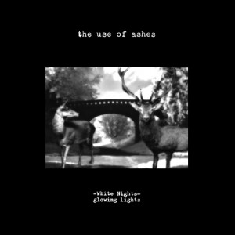

artist: **The Use of Ashes** release: _White Nights: Glowing Lights_ format: LP, CD year of release: 2009 label: tonefloat duration: 45:37

From Nijmegen in the Netherlands hails **The Use of Ashes**, a band consisting of the brothers **Peter** and **Simon van Vliet**, and **Maarten Scherrenburg**. The first two were active in the early 80's in the avantgarde wave band **Mekanik Kommando**. Their style has changed over the years though, and this latest album (second in the _White Nights_ series) is firmly in the realm of psychedelic folk.

For me, this album is somewhat of a mixed bag. The overall sound is rich and wonderful; a blend of folk with experimental and dronish parts, and above all a great ear for detail and sophisticated sound design. It reminds me perhaps perhaps most of **Twelve Thousand Days** in terms of style, though **The Use of Ashes** lacks the appeal of a unique and excellent vocalist like **Martyn Bates**. This is at least in part compensated for by the lavishness of the sound.

The main turn-off for me, however, is that a number of tracks on _White Nights: Glowing Nights_ (such as the opener and "Stranger in Paradise") wax somewhat too sugary-sweet, expressed in the lyrics, vocals, and general atmosphere. It's something of an acquired taste, perhaps, and part of artistic expression. It might not bother other people, but it doesn't do much for me personally. What is clear to me, however, is that the band's main strength lies in composition and sound design, rather than text or vocals. This can be heard in some of the highlight tracks like the excellent misty neofolk of "Falling from the Sky" or the folky drones of "9 Glowing Lights".

Altogether, _White Nights: Glowing Lights_ is a pleasant album that fits neatly into the psych side of the **tonefloat** roster, with artists like **Porcupine Tree** and **Sand Snowman**. The spectre of **Pink Floyd** is ever present. If you're open to a well-succeeded Dutch psych folk album with a bright and sweet atmosphere, this is well worth your attention. Personally, I can't help but feel that it is a bit less interesting and original than the stuff that went on in the **Mekanik Kommando** days.

Reviewed by **O.S.**

Tracklist:

1\. Morgenstern (The Umbrella Jigsaw Man) (2:26) 2. Falling from the Sky (5:32) 3. Stranger in Paradise (1:55) 4. Forever Comes with the Morning (1:55) 5. Zeit (1:14) 6. Kiss the Light (2:10) 7. Dark White Planet (2:43) 8. Dongal Taleteller (Part 2) (1:04) 9. White Night (0:31) 10. King of the Moon (0:53) 11. Lazy Daisy Day (3:07) 12. Eidolon (Days Are Darker Nights) (4:53) 13. The Sky-Cracked Children (0:58) 14. The Prince With the Golden Hair (3:07) 15. Stiller Berg (2:30) 16. 9 Glowing Lights (7:35) 17. White Dream (2:00) 18. Endstille (1:04)
