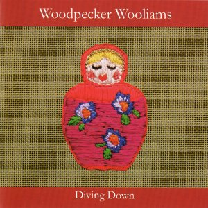

artist: **Woodpecker Wooliams** release: _Diving Down_ format: CD year of release: 2009 label: [Autumn Ferment](http://www.autumnfermentrecords.com) duration: 35:25

detailed info: [discogs.com](http://www.discogs.com/Woodpecker-Wooliams-Diving-Down/release/2005280)

Scottish label **Autumn Ferment** seems to be going strong, and this imprint delivers its best album to date with **Woodpecker Wooliams**'s _Diving Down_, a mighty fine piece of modern experimental folk.

The woman behind this project is one **Gemma Williams**,  hailing from Brighton in the UK. Apart from an excellent voice at the high end of the spectrum, she brings a well-chosen and original instrumentarium to the table. Harp seems to be a staple instrument in many tracks - making comparisons with **Joanna Newsom** slightly relevant - but we've also  recorder, clarinet, quirky percussion and a slightly surprising yet pleasant amount of drones.  Not to mention the often underestimated uses of beer bottles filled with varying quantities of liquid! In short, a sound that fits in tightly in today's new weird folk current, without ever running the danger of being too conventional.

Technicalities aside, though, _Diving Down_ is simply an excellent album. Williams writes original and at times touching lyrics, and presents them over compositions that are traditional and familiar, yet presented in the proper fashion: folk the evolves with the times, changing traditions that have a shifting but profound core. A sea shanty like the title track should be proof enough.

Lines of connection leading to other women in modern folk music present themselves at times, and deserve to be mentioned. The somewhat dark and melancholic touches that are present in this album will certainly appeal to those who are fond of **Marissa Nadler**'s style, but in general I think this album will be enjoyed by anyone who is fond of strong female artists in today's scene. Hell, there's even some **Kate Bush** in here.

Considering this is her debut album, I'd say she delivered an excellent work that's highly enjoyable in itself, without referring to all those other artists. If you enjoy well-written and well-played modern folk, do check out this release. It's highly promising and this lady deserves a big audience.

Reviewed by **O.S.**

Tracklist:

1\. Put A Bird (4:33) 2. The Lamentable Love Of The Barometer (2:07) 3. Perm (2:22) 4. Diving Down (5:00) 5. Out Walking (3:58) 6. I Shot You (3:00) 7. In Your Mouth (4:43) 8. Threads (2:36) 9. Wife (7:06)
