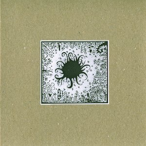

artist: **Joonatan Elokuu** release: _Mushroom Heart_ format: CDr year of release: 2009 label: [Kiiltomatolyhty](http://kiiltomatolyhty.blogspot.com/) duration: 43:20

detailed info: [discogs.com](http://www.discogs.com/Joonatan-Elokuu-Mushroom-Heart/release/1939251)

Insiders in the modern psychedelic and alternative folk scene might have become acquainted with the Finnish project **Aura Shining Green** over the past few years. By now, names and project concepts have been changed, and **Joonatan Elokuu** has released this new full-length album under his own name, though bringing back a couple of songs from the older period.

For those new to this Finnish songsmith, I can say his sound is informed by psychedelic folk both from the early period around the changeover of the sixties and seventies, as well as later and contemporary psychfolk artists. In particular, Joonatan's sound can be compared to that of **In Gowan Ring** and **Stone Breath**, though without being altogether unoriginal.

_Mushroom Heart_ itself is a very pleasant and successful debut album, containing a varied mix of acoustic songs. It opens up traditionally with Joonatan's wife **Helena Halla** intoning "Adieu to Old Finland", which soon becomes a duet and then morphs into a psychedelic misty piece with a banjo lead. "Rain Falls Hard on Camden Town" is a classic track from the **Aura Shining Green** days; another duet with a great melancholic atmosphere and rich sound structure. Other highlights include the americana-ish rendition of **Donovan**'s "The Little White Road", and the final track, a version of **C.O.B.**'s "Solomon's Song" that transforms into a marvellous ambient folk drone. In general though, the album is strong and varied, finding a perfect balance between folk from different eras and continents, and a music that breathes a spirit of freedom, travel, and spirituality.

It seems Joonatan and Helena are all set to release more music, under both their own names, so there's much to look forward to! Until then, this edition of CDr copies is bound to sell out fast, so be quick if you are into psychedelic folk, because this is an underground album to cherish.

Reviewed by **O.S.**

Tracklist:

1\. Adieu To Old Finland — Trees, Stones, Earth (6:19) 2. Rain Falls Hard On Camden Town (3:54) 3. Purjehduslaulu (3:17) 4. The Little White Road (3:05) 5. The Calling Of Crows Beckons Us Home (4:50) 6. A Hushed Lullaby (To The Old Windmill) (4:17) 7. Willowisp Lantern (2:37) 8. Solmu Loputtomalla Langalla (3:52) 9. As Fair As Gilead — Anneli (11:29)

bf3a-78jd's
