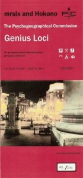

artist: **The Psychogeographical Commission** release: _Genius Loci_ format: CDr, CD year: 2008, 2009 label: [Self-released](http://www.psychetecture.com/) duration: 52:45

detailed info: [discogs.com](http://www.discogs.com/Psychogeographical-Commission-Genius-Loci/release/1710020)

Originally released in late 2008, _Genius Loci_ is the debut album of the English duo **The Psychogeographical Commission**, consisting of **mrsix** and **Hokano**. Their music, as the band name indicates, is dedicated to exploring the psychological characteristics and effects of the (urban) landscape, in this case, focused on London. This is explored musically by fusing influences from ambient, industrial, field recording, and experimental music in general.

The result is a collection of songs that charts different aspects of the theme chosen for this album, varying between a number of musical modes in between. Some tracks explore spoken or sung narratives and conventional song structure, others are geared more towards field recordings and drones. On the whole, the experimental bent of the music reminds me somewhat of later **Coil** material, but perhaps most of all of **English Heretic,** who blaze a similar trail through England's psychogeography.

Though _Genius Loci_ has elements in common with the artists aforementioned, I feel it lacks a bit of the originality or salience inherent in their works. The album flows nicely and has enough variation to never bore, not to mention a great atmosphere. Nevertheless, I miss a bit of an edge or challenging touch in these tracks. The album is best experienced as it was also intended by the artists: as a musical and aural backdrop when exploring an urban environment oneself. In such a setting, _Genius Loci_ shows its strengths more than in any other.

For lovers of experimental music in the (post-)industrial corner with a fascinating conceptual backing, _Genius Loci_ is well worth your time and money. Two versions are currently available: the original CDr release, housed in a map-like double gatefold, limited to 250 copies (pictured here), and the remastered CD edition in slimline DVD packaging.

Reviewed by **O.S.**

Tracklist:

1\. The Fires Of London (4:22) 2. Camden Book Of The Dead (4:00) 3. Have You Ever? (4:24) 4. Where Roots Think Of The Child (3:54) 5. Spare Thoughts (5:58) 6. The Ones Who Walked Before (8:16) 7. Genius Loci (6:34) 8. Certain Shifting Angles (4:40) 9. OK Commuter (10:38)
