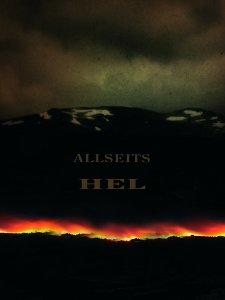

artist: **Allseits  
**release: _Hel  
_format: CD  
year of release: 2009  
label: [Cyclic Law](http://www.cycliclaw.com/)  
duration: 44:27

detailed info: [discogs.com](http://www.discogs.com/Allseits-Hel/release/2053679)

The latest **Cyclic Law** release is _Hel_ by **Allseits**, the project of **Nina Kernicke** from Bremen, Germany. Nina also records as **All Sides**, the name she used for her collaboration with **Troum** on _Shutûn_. The current album is a trademark **Cyclic Law** release in the area of dark ambient drones with a spacey touch.

The album follows the course of a journey to the underworld of Norse mythology, from the roots of the World Tree Yggdrasil to the realm of (and corresponding goddess) Hel itself. We travel across the river (and bridge) of Gjöll, where the guardian Móðguð is encountered. Up next is Garm, the Nordic counterpart to Cerberus, the guardian hound of the underworld. The penultimate encounter is Fjalar, a name which can refer to both a dwarf and one of the roosters that will crow in the day of Ragnarök. Finally is Hel itself. In a musical journey, then, we somewhat retrace Hermóð's quest in the Prose Edda to retrieve Baldr from the hellish realm.

Interesting concept matter aside, _Hel_ is a decent and rewarding album that will appeal particularly to lovers of very dark and obscure drones, in the vein of projects like **Svartsinn** and **Kammarheit**. In that sense, the album is perfectly at home on this label. It's not too long and each track has theme and structure different enough to keep the album interesting for the almost 45 minutes of its duration. In particular the closing title track is quite good, with its classic slow crescendo buildup.

However, you certainly won't find any innovation here, which is perhaps typical of the genre at this moment. Dark ambient has been established as a unique and interesting style over the past fifteen years or so, but such a crystallisation inevitably leads to stagnation in many cases. As such, this is a perfect album if you can't yet get enough of this kind of music, but not quite what you're looking for if you seek the cutting edge of modern ambient.

Reviewed by **O.S.**

Tracklist:

1\. Yggdrasil (6:44)  
2\. Gjöll (8:01)  
3\. Modgudr (6:47)  
4\. Garm (9:02)  
5\. Fjalar (7:45)  
6\. Hel (6:08)
