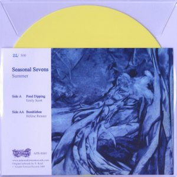
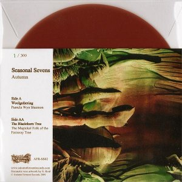

artist: **Emily Scott / Hélène Renaut; Pamela Wyn Shannon / The Magickal Folk of the Faraway Tree** release: _Seasonal Sevens: Summer; Autumn_ format: 7" year of release: 2009 label: [Autumn Ferment](http://www.autumnfermentrecords.com/) duration: 6:27; 5:55

detailed info: discogs.com ([summer](http://www.discogs.com/Emily-Scott-H%C3%A9l%C3%A8ne-Renaut-Seasonal-Sevens-Summer/release/1880441); [autumn](http://www.discogs.com/release/2075948))

The _Seasonal Sevens_ are a series of 7" double A-sides released by **Autumn Ferment Records**. Starting out in summer 2009, each season will see a new release, featuring tracks from a variety of contemporary folk artists. So far, we've had a summer and an autumn release, and the winter edition is bound to follow soon.

\[caption id="attachment\_740" align="alignright" width="150" caption="Seasonal Sevens: Summer"\]\[/caption\]

The first 7", release on bright sun-bleached yellow vinyl, contains previously released tracks by **Emily Scott** and **Hélène Renaut**. Scott, based in Edinburgh, ushers in the summer with a laid-back sweet track, supported by **Malcolm Le Maistre** and **Pete Baynes** on banjo and ukulele. A nice old-timey careless summer feeling is invoked. San Francisco-based Breton singer/songwriter Renaut brings a shorter, bittersweet track that's warmer and hazier than the first. Excellent picks by the label, as both tracks conjure up a sultry feeling with modern folk that harks back to the 60s and 70s.

\[caption id="attachment\_741" align="alignleft" width="150" caption="Seasonal Sevens: Autumn"\]\[/caption\]

Autumn is represented by two tracks I'd already heard on earlier releases. The clear brown vinyl holds "Woolgathering" by **Pamela Wyn Shannon**, taken from the album [_Courting Autumn_](http://www.eveningoflight.nl/2008/04/01/review-pamela-wyn-shannon-courting-autumn-2007/), and "The Blackthorn Tree" by **The Magickal Folk of the Faraway Tree**, taken from their EP _The Mildew Leaf._ It might not be the best off her excellent album, but Shannon's track is a warm and romantic song steeped in autumn atmosphere, gathering both actual and metaphoric wool to keep the impending cold at bay. **The Magickal Folk of the Faraway Tree** are one of the bands from out of the **Deserted Village** collective, including a host of people active in other projects. "The Blackthorn Tree" is (or could pass as) a traditional folk classic about love's mysterious ways and wiles. An austere and loving performance, with vocal harmonies by **Dave Colohan** and **Shane Cullinane**, and **Sean Òg** on flute.

Of the two, I think the autumn single is slightly more successful musically, because of its originality, but both 7"s manage to capture the atmosphere of the season in a highly appealing way. I recommend, therefore, to treat the series as a whole, in order to experience the full scale of sound. Anyone interested in contemporary folk is urged to check these out, and the price is no impediment, at only about five pounds each. They're all limited to 300 copies, though, so act quickly if you still want the summer and autumn editions as well. Here's to the next two!

Reviewed by **O.S.**

Tracklist:

_Summer_ A. **Emily Scott** - Pond Dipping (3:40) AA. **Hélène Renaut** - Bumblebee (2:47)

_Autumn_ A. **Pamela Wyn Shannon** - Woolgathering (3:44) AA. **The Magickal Folk Of The Faraway Tree** - The Blackthorn Tree (2:11)
