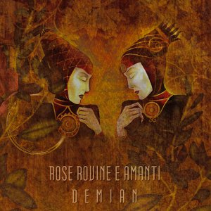

artist: **Rose Rovine E Amanti** release: _Demian_ format: CD year of release: 2009 label: [Cold Spring](http://www.coldspring.co.uk/) duration: 42:52

detailed info: [discogs.com](http://www.discogs.com/Rose-Rovine-E-Amanti-Demian/release/1739719)

Recorded in Rome in 2008, _Demian_ is the second full length album by **Rose Rovine E Amanti** (mastermind: **Damiano Mercuri**) on **Cold Spring Records**. The album collects ten tracks of hot-blooded neofolk with a flair that is the trademark of many Mediterranean artists working in this field.

The songs on this album alternate between Italian and English, balladry and more powerful rock-influenced tracks, striking an enjoyable balance between calm pieces and more bracing work. There is a strong influence of Southern European folk and pop sensibility, which places the sound somewhere on a continuum between **Sangre Cavallum** and **Spiritual Front**. The more rocking tracks tend to stand out, because they offer a gripping appeal that is not present as much in the more generic slow songs. The title track is easily the best, fusing heavy martial industrial percussion with powerful acoustic guitar chords and a catchy song structure, and a swirling violin solo by **Giuseppe Lorenzoni**, reminiscent of **Matt Howden**'s style. Equally strong is the bass-driven "From Desperation to Victory", highlighting the martial theme that is still at the forefront of much contemporary neofolk.

And, like many of his contemporaries, Mercuri isn't truly pushing the (sub)genre any further. The themes, the style, the sound, the atmosphere, we've heard it before in quite some places. In this sense, **Rose Rovine E Amanti** is a natural player in the process that practically all specialised styles of music succumb to: stagnation. That doesn't mean _Demian_ isn't a good or enjoyable album, because it certainly is, if you're in the right mood. It does mean that this album is niche music and recommended mostly to people operating within that niche.

Reviewed by **O.S.**

Tracklist:

1 Il Gatto Osserva (2:30) 2 Rose Rovine E Amanti (5:17) 3 Demian (3:53) 4 Il Grande Tradimento (5:04) 5 From Desperation To Victory (2:50) 6 The End Of This World ( 5:00) 7 Paura Del Demonio (5:23) 8 Mille Serpi (3:47) 9 Noi Ritorneremo (3:39) 10 Ave Maria (5:34)
