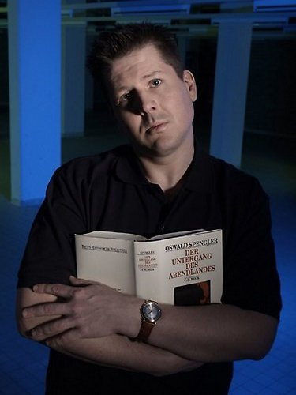

Only recently, after reading his necrology for a local bookstore, we complimented him on the way he was able to fill such memorial texts with true poetry and touching words. "Yes," he said, "but why does it always have to be necrologies?" Perhaps because we only realise what we've lost until it's gone?

On Wednesday January 20th 2010 we heard the shocking news that Arjen Grolleman had passed away suddenly, having had a fatal accident at home. Arjen was a station manager and DJ at KinkFM, as well as a prolific voice-over for national Dutch television and other media. At KinkFM, he presented the programs [Avondland](http://www.kinkfm.com/programma/Avondland) and [X-Rated](http://www.kinkfm.com/programma/X-Rated), the latter of which was _the_ show for experimental music on Dutch radio. Through X-Rated, together with co-presenter Bob Rusche, he expressed his love for alternative and experimental music in a way that was honest, remarkable, and memorable, as well as giving it a solid place in mainstream Dutch media, inspiring many listeners and supporting a great number of artists and labels. Poetry and the spoken word always had a firm place in his programs as well, with recordings of Dutch and foreign poets and other important writers featuring alongside marvellous underground music. Where else could one hear a track by Coil after a speech by Noam Chomsky and a poem by W.H. Auden?

In Arjen, we also lost a dear friend. We remember fondly the long evenings turning into early mornings, filled with deep conversation, laughter, and wine. Arjen was the perfect companion for a discussion about music, literature, culture, art, poetry, life, perfume... He was ever inspiring; after hearing him speak about his Rosicrucian tour through Paris, you can't help but want to follow in his footsteps. And we can't even remember how many records we've sought out after having heard them played on X-Rated.

His friends were always able to follow [his daily adventures and travels on Twitter](http://twitter.com/arjengrolleman), a medium which he had utilised to perfection, with an excellent sense of timing and content. A lovely feeling in the morning: turning on your PC, and seeing a first-hand account of Arjen and his radio colleagues, rushing down the slope in front of the KinkFM studio in their desk chairs in the middle of the night.

Arjen was an exceptional person. Exceptionally driven, exceptional in his idealism, his interests, and his passions. He was able to put his spirit into all of his work and interests, turning it into something more. The way in which he made his job out of his passions is equally admirable and inspiring. He was also gentle, loving, and hospitable. We wish with all our hearts that we would have been able to spend more time with him, but it was not to be. We hope he has found a loving embrace in whatever awaited him in the hereafter... the warmth of the sun, floating on the æther, a drink with Jhonn Balance?

Our thoughts are with Arjen's family, friends, and colleagues, all of whom we wish much strength in coping with this great loss.

\-Oscar & Diane

http://www.youtube.com/e11IIXiKvYY
