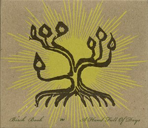

artist: **Birch Book** release: _Volume III: A Hand Full of Days_ format: CD, LP year of release: 2009 label: [Little Somebody](http://www.myspace.com/littlesomebody) (CD), [Ahnstern](http://www.steinklang-records.at/) (LP) duration: 60:41

detailed info: [discogs.com](http://www.discogs.com/Birch-Book-Vol-III-A-Hand-Full-Of-Days/master/179156)

After releasing the excellent second **Birch Book** album in 2007, and a couple of successful tours with the likes of **Woven Hand**, **Faun**, and **Sieben**, it was time for **B'eirth** to settle down and record the follow-up, which is what I hold in my hand now. _A Hand Full of Days_ was released on CD by **Little Somebody Records,** who've found a perfect addition to their roster with this album, and the vinyl edition was once again handled by **Ahnstern**.

The album is constructed in symmetrical fashion, with the instrumental birch tracks opening and closing the album, as they have done twice before. Also at opposing places are "Left Hand" and "Right Hand", atmospheric instrumentals that provide a repose from the ten songs that make up the bulk of this hour-long album. The songs are in a style that has been more or less the same throughout the past decade: gentle singer/songwriter folk, with clear influences from psychedelic and neofolk, as well as touches of americana.

The production and polishing of B'ee's music has never been better than on this album, which lends it a strong appeal, though I must say _A Hand Full of Days_won't turn any heads in terms of innovation. B'ee does what he does best, and his strengths lie mostly in creating gentle, flowing songs with eloquent lyrics. At times, a darker atmosphere is achieved, on an instrumental like "Hatched in Stone", which is an excellent track, but held back by a sense of understatement that works better on peaceful tracks like "Patchwork Woman".

Altogether, though, this is another good album from one of the more unique voices in contemporary alternative folk. It most certainly won't disappoint fans like me, but newcomers will find much to enjoy as well, especially if you have a love for calm, laid-back folk.

Reviewed by **O.S.**

Tracklist:

1\. Birch Leaves (2:08) 2. Feet Of Clay (3:30) 3. Empty Corner Of The Page (5:42) 4. Left Hand (3:36) 5. Patchwork Woman (5:16) 6. Stray Summer Song (6:28) 7. Hatched In Stone (6:57) 8. Sad Song (3:39) 9. Nothing More (3:23) 10. White Angel (4:52) 11. Right Hand (4:02) 12. Life's Lace (3:52) 13. Will Of The Wind (5:02) 14. Birch Leaves (2:14)
