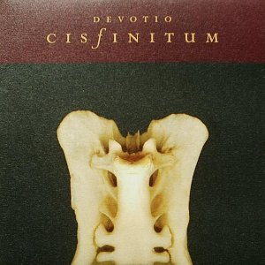

artist: **Cisfinitum** release: _Devotio_ format: 10" year of release: 2006 label: [Substantia Innominata](http://www.substantia-innominata.de/) duration: 23:49

detailed info: [discogs.com](http://www.discogs.com/Cisfinitum-Devotio/release/809332)

One of the ways in which experimental music can be thought-provoking is to take a familiar sound source and bend, stretch, twist or mangle it until it achieves a whole new level of expression. Listening to such an everyday sound _an sich_ can already be an amazing experience if you listen attentively and with a receptive spirit. But there is something intriguing about hearing a sound actually modified, unlocking sound levels normally only accessible through the imagination.

Here we have **Cisfinitum** (**Evgeny Voronovsky**), and on _Devotio_, his medium is the church bell. While the tolling of bronze is a staple in gothic, ambient, metal, pop, or indeed any genre with a potential for pompousness, it is in itself a modest but extremely rich sound, laden not only with multiple sound layers, but a great many cultural echoes as well. On this EP, though, it serves as the carrier of many musical textures. The deep, reverberating sounds work as underlying drones; the moment where the clapper hits the metal, when looped, becomes a rhythmic base; the tolling itself, clean, echoed, delayed, provides many melodic layers. Together, two intricate and sophisticated soundscapes are crafted, pieces that utilise the possibilities of sound manipulation to nigh perfection. Despite the usage of a single sound source - and a very specific one at that - as the building blocks of these tracks, Voronovsky avoids the pitfall of exaggerated minimalism. The overall sound is always layered, and het is not afraid to add a small touch of different sounds here and there, such as some faint violin or distorted voices.

There's a bit of many industrial subgenres in here: drones, metal percussion, loops, ambient waves, theat general sense of being caught in an irresistible musical maelstrom. When done right, such elements lend music a ritual and spiritual character that is a unique quality of music only. The ability to take your consciousness to new modes, if only for a short while. In the case of _Devotio_, it's all in place: the music, the packaging and cover art, the muddled white vinyl. This is, quite simply, how it's done.

Reviewed by **O.S.**

Tracklist:

A. (12:59) B. (10:50)
