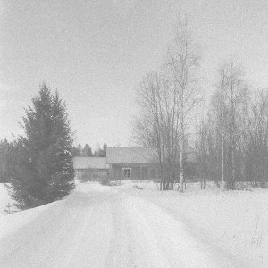

artist: **Tervahäät** release: _Tervahäät_ format: CD year of release: 2009 label: [Anima Arctica](http://www.animaarctica.fi/) duration: 36:26

detailed info: [discogs.com](http://www.discogs.com/Tervah%C3%A4%C3%A4t-Tervah%C3%A4%C3%A4t/release/1955223)

The fifth release from Finnish underground label **Anima Arctica** is this self-titled debut work by **Tervahäät**, a duo consisting of Antero Väätäjä and Ilmari Akkanen. This shortish but interesting album builds bridges between raw post-industrial ritual tracks and frosty Finnish folklore.

From the start of the album on, we are presented with the successful instrumental base of this project that returns in most of the tracks: banjo and bass melodies overlaying rumbling industrial soundscapes, varied organic percussion and some seething electric guitar work. Longer tracks like "Otava" forge these elements into extended ritual journeys, accompanied by pathos-filled vocals in Finnish.  The accompanying sheet of English text (a translation of the lyrics?) speaks of animals, spirits, and mystic poetry. In general, the music of this album is not easy to get into; while there are accessible tracks like the Nordic neofolk of the instrumental "Joulukuu", the greater part of the album is rather esoteric and demands a receptive mood, one that resonates with the cold and oppressive visual imagery. It is perhaps typically Finnish in the sense that it doesn't open up at the first listen.

However, despite this closedness and lack of very direct compositions that immediately grab you by the throat, **Tervahäät** manages to deliver an album that has a compelling mysticism about it, as well as an original sound that blends organic, industrial, and folkloric elements. The foundations for an interesting musical oeuvre have been laid here, and lovers of experimental post-industrial music should definitely check this album out. It will be especially appealing if you have an ear for Finnish underground music of the past decade.

Reviewed by **O.S.**

Tracklist:

1\. Lumi (2:55) 2. Otava (12:02) 3. Hautaa (4:50) 4. Kalankallo (3:08) 5. Menneet (9:12) 6. Joulukuu (1:30) 7. Lähdin (2:54)
