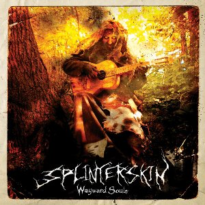

artist: **Splinterskin** release: _Wayward Souls_ format: CD year of release: 2009 label: [Cold Spring](http://www.coldspring.co.uk/) duration: 44:49

detailed info: [discogs.com](http://www.discogs.com/Splinterskin-Wayward-Souls/release/1903950)

Ohio-based musician **Splinterskin** released his debut album on **Cold Spring** last summer, a full-length piece filled with moody and unnerving dark folk. The many short pieces on this record breathe an atmosphere of forest nights, creaking walls, and spiritual horror that is the lifeblood of that typical dark natural æsthetic that has developed over the past 15 years or so.

The musical base consists of fingerpicked acoustics, sometimes calm, sometimes frantic and quick, with mystical and dark chords that form the melody of this record. Samples of nature sounds and other wayside encounters emphasise the context of the lyrics that deal with various subjects. Foremost are tales of terror and dark folklore: wooden puppets with a life of their own, hidden creatures, old gods. An at times welcome variation is provided by more personal reflections on tracks like "The Skarekrow (October Roads)",  one of the best tracks on the album.

Criticism can certainly be levelled at precisely these æsthetics. You have to be in a certain mood to appreciate these grim tales and the demented storyteller voice of **Splinterskin**, though that isn't a problem in itself. Rather, both the musical and lyrical stakes seem to be in atmosphere only, while the underlying substance is rather meagre, a downside that occurs regularly in this area of thematics.

Still, what _is_ there is consistent, moody and expressive, an enjoyable trip through magical autumn woods that will please lovers of dark folk in the vein of bands like the **Empyrium** of give or take ten years ago, especially with a touch of dark atmosphere added.

**Reviewed by** **O.S.**

Tracklist:

1\. Chanting Bells Call Shadows (1:45) 2. Dancing Dead Men (3:42) 3. The Crumbling Cabin (2:06) 4. Something In The Walls (2:56) 5. Moonlight Rain (2:49) 6. The Thing That Wasn't (2:00) 7. Broken Down Hearse (1:46) 8. Still At The Windowsill (3:33) 9. Hoofbeats (1:40) 10. The Eyes That Hide (3:31) 11. The Skarekrow (October Roads) (3:20) 12. A Horrible Night To Have A Curse (4:15) 13. Black Bird Sorrow Song (0:47) 14. The Man On The Porch (3:13) 15. A Trail Of Trees (2:42) 16. Wayward Souls (3:52) 17. Dancing Dead Men (Reprise) (1:01)
