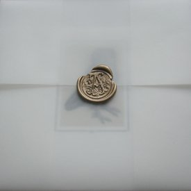

artist: **Autumn Grieve** release: Stray Birds format: CDr year: 2009 label: [Corbel Stone](http://www.corbelstonepress.com/) duration: 24:42

detailed info: [discogs.com](http://www.discogs.com/Autumn-Grieve-Stray-Birds/master/185539)

The world is full of gems. Some you find after a long time of frantic searching and toil, hidden away somewhere. Others you just find on your travels, through sheer luck or coincidence, or perhaps left in its place by someone. _Stray Birds_ is, then, like a pebble found in a meadow, polished by time or some unknown source, with a simple, unique beauty.

Grieve's songs for voice and acoustic guitar have an elegant and natural poetry that fits perfectly with the gently beautiful atmosphere created by the sound and presentation of this release. In the background, we hear subtle arrangements for strings and piano by **Richard Skelton**, who manages excellently to supplement these songs without becoming obtrusive, enhancing the musical whole rather than cluttering it.

_Stray Birds_, like its predecessor _Terra Infinita_, is a release that turns inward rather than to the outside, finding a beautiful expression in its own realm, without any obvious distraction of musical citations or direct influences. Quite fitting, then, that an EP like this is limited to a couple of very small, handmade editions. Like those special pebbles, you have to venture out to find them, but the rewards are plentiful for those with an open spirit.

Reviewed by **O.S.**

Tracklist:

1\. Alight (3:45) 2. Within Hollows (4:56) 3. Shades (3:17) 4. Revenants (4:33) 5. Depart (3:46) 6. Kneel (4:25)
