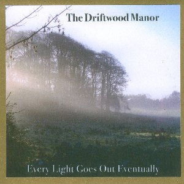

artist: **The Driftwood Manor** release: _Every Light Goes Out Eventually_ format: CDr year of release: 2009 label: [Slow Loris](http://www.stevefanagan.com/aboutslowloris.htm) duration: 27:34

detailed info: [discogs.com](http://www.discogs.com/Driftwood-Manor-Every-Light-Goes-Out-Eventually/release/1911293)

After a very successful debut (mini-)album, _A Gathering_, in 2008, **The Driftwood Manor** bridge the gap to the next one with an EP release on Irish d.i.y. label **Slow Loris**. _Every Light Goes Out Eventually_ is again a wonderful piece, though different from its predecessor, this time around with a focus on a meditative minimalism combining folk and drones.

"The May Floods Came" opens this EP with layered mantra-like chanting, backed by oriental drones on tampura and guitar chords. About halfway, a short piece of lyrics is delivered by **Eddie Keenan**, the man behind the project, after which the track returns to its basic mode. Of a similar nature is the central title track, which consists of a profoundly melancholic piano line of harmonic intervals, overlaying another subtle drone. Faint field recordings are heard here and there, as well as a deeper, darker drone. The release ends with a short coda, the folk-oriented "Before it Is Time". It's a beautiful brief piece for vocals and guitar, ending in a series of haunting chords for oriental strings.

And so, this record, centered around the theme of death and loos, comes to an untimely end itself. One wishes this gem, which reminds me of **Current 93**'s _Sleep Has His House_ in its melancholic minimalism, would have lasted longer. Thankfully, unlike people, CD players are equipped with reset buttons...

Reviewed by **O.S.**

Tracklist:

1\. The May Floods Came (12:58) 2. Every Light Goes Out Eventually (11:11) 3. Before It Is Time (3:25)
