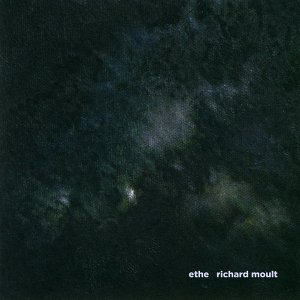
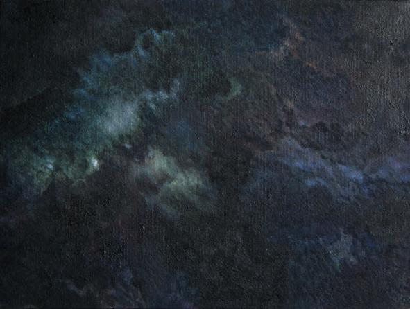
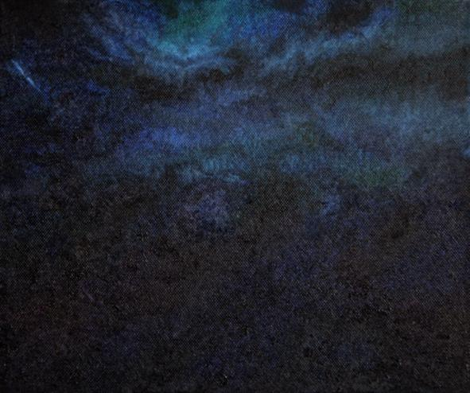
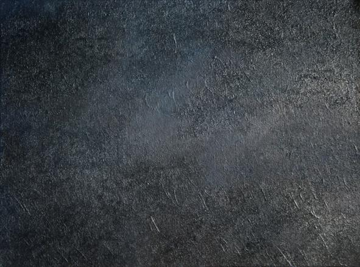
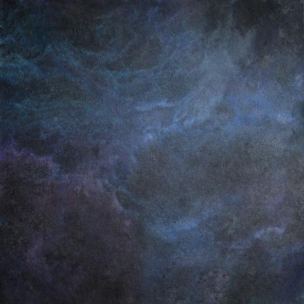
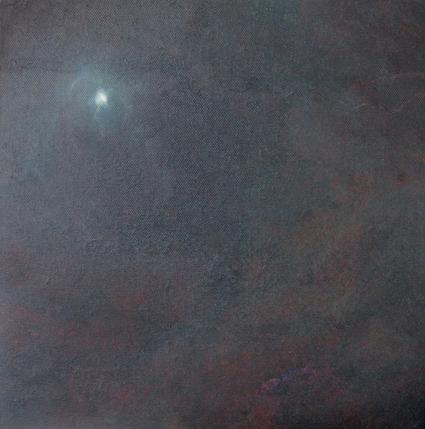
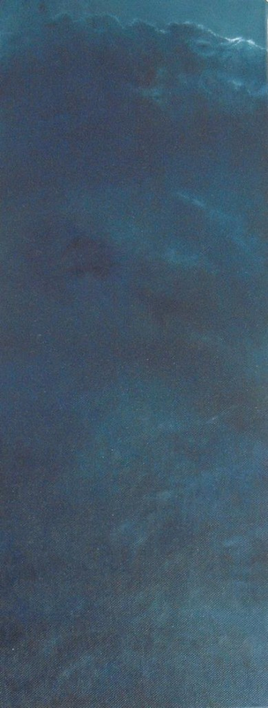

artist: **Richard Moult** release: _Ethe_ format: CD year of release: 2010 label: [Deadslackstring](http://www.deadslackstring.com/) duration: 53:26

detailed info: [discogs.com](http://www.discogs.com/Richard-Moult-Ethe/release/1859304)

In the barren days of the present many of us look around for art that is serious without being pretentious; that is beautiful without being kitsch; that is challenging without being alienating; that is autonomous without being egotistical; that is melancholy without being self-indulgent. And we usually look in vain, because such art is no longer wanted in the modern market place where art itself has become a branch of the entertainment industry, designed to elicit shallow responses and provoke false outrage. In this cultural desert, the seeker after true art will see the work of the English composer and painter **Richard Moult** as a welcome oasis.

Richard’s new album, _Ethe_, is one musical manifestation of a wider project that also encompasses poetry and painting. This new phase represents something of a departure from Richard’s earlier work. As a painter his mature work began with a series of landscapes, mostly of the Welsh Marches. These works conveyed such a lucid apprehension of the landscape that they seemed to be direct expressions of the essence of the natural world, rather than mere depictions of it. They conveyed to the viewer something of the secret soul of nature as experienced and mediated by the artist in his relationship with his environment. In these paintings the world of nature was not some external thing that the artist tried to frame, or master; instead she was an intimate ally who was worshipped.

Increasingly, figures began to appear in the landscapes: birds; young girls; statues; foxes. And then, as these elements began to form a coherent and unique artistic perspective, there came the appearance of some surreal and idiosyncratic devices: figures formed in the clouds; sinister children dressed in outdated clothing. Throughout all of these explorations there was a strong sense of style and vision that remained consistent. Whatever the subject matter, there was always a clarity to the execution of the work and an accessibility of form that made the paintings come alive.

A few years ago this carefully developed style was put aside and the mysterious _Ethe_ paintings began to appear. These pictures seemed to signal a complete break from what had gone before. Abstract, dark, and formless, the Ethe paintings suggested that the artist was retreating completely into a world of interior symbolism, and that the clarity of vision that had applied itself so successfully to the world of nature would now be turned inwards. The Ethe paintings are dark, cloudlike, with the occasional leakage of light pouring through. Where before sunlight had burst through clouds with violence and passion, seeding nature with its life giving power, now the light is dim, unclear, muted. In these new paintings, the clouds are dark and oppressive, the light, fugitive and weak. And beyond the interplay of the cold light and the cold darkness, there is nothing; no hint of landscape, no grounding in any recognisable imagery. What is clear from the Ethe paintings is that we are no longer dealing with art which attempts to mediate the artist’s vision through a shared landscape; these are raw and primal expressions of desolation.

Similarly, the album, Ethe, represents a new musical direction. Many of Richard’s previous compositions had been settings of poems in the song tradition of composers such as **Schubert**, **Fauré** and **Finzi**. These songs, many of which were settings of **Mary Webb** poems, were all composed with the intention of allowing the music to be subservient to the poetry. The role of the composer was to allow the inherent musicality of the poetry to express itself. In this sense, these were very conservative compositions. They eschewed modern conventions and refused to be platforms for the composer’s own intellectual ideas, or ego. But despite (or perhaps, because of) the conventional form these songs took, they were small masterpieces that were capable of conveying great emotional feeling through their melodies. Despite the superficially “old-fashioned” style, these were songs that could communicate directly with the listener because the musical vision was expressed with such clear intent and focused eloquence. Part of this eloquence consisted in the accessibility of the melodies which provided such a pleasing and appropriate reflection of the poetry's form. With _Ethe_, this convention of form has disappeared.

The new phase was presaged with the release of the two limited edition CDs, _Suite for Titouan_ and [_Suite for Hippolyte_](http://www.eveningoflight.nl/2009/06/01/eol01-richard-moult-suite-for-hippolyte/). These consist of solo piano pieces that are dark, brooding and less accessible than the earlier song compositions. The tone of intense melancholy is sustained throughout these suites, and is explored further and deeper with the music on _Ethe_. The outstanding moment from these Suites is the concluding movement from Titouan which begins with a sense of tidal ebb and flow and concludes with a brooding and introspective sense of irresolution. A storm is brewing, but will it break?

_Ethe_ begins with a five part piece entitled "The Five Daughters". This opens with a feel not too dissimilar to **Satie**’s "Gymnopédies", but it soon reveals that its real intent lies, not in the imitation of earlier forms, and certainly not in the emulation of an intellectualised experimentalism, but rather in the expression of a deeply felt, intuitive, musical melancholy. Whilst this music is certainly darkly introspective and serious, it is nowhere unpleasant or disengaging. Indeed, when listened to superficially it can sound like a pleasing, if downbeat, impressionist work, in the vein of **Satie** or **Debussy**. But, like a river, the pretty surface conceals murky depths with dangerous undercurrents.

Much of the music on _Ethe_ lends itself to comparisons with natural phenomena: rain; thunder; rivers. The comparison is important: this music expresses certain subjective emotions, but this expression is never allowed to become undisciplined and self-indulgent. Instead, the emotional power of the music is always commensurate to natural phenomena. Whether this is intentional or not, I do not know, but with repeated listening it becomes apparent that this music is measured against the slow changing backdrop of natural phenomena. The subject matter seems to be the interior emotional landscape of the artist himself, but the articulation of this interior landscape is certainly rooted in the natural world. This dialectical conversation between the interior and the exterior produces some masterpieces of understated beauty.

A couple of the pieces on _Ethe_, "Swaermian", and "The Road to Strata Florida" I and II, utilise a technique referred to as ‘Lysergic Morphing’. As the name implies, this has a slightly hallucinatory effect, being a modulation of the piano music combined with an ominous sounding overlay of droning effects. The effect of this is to liberate the music from the confines of its own instrumentation and to achieve a transcendence to a more ethereal sound. This effect, I believe, is one that is intended by all of the music on _Ethe_. It is a desire to free the music from particular forms of association, and ultimately from form itself, so that the music will allow certain stilled, contemplative states to be gained.

We are used to hearing music that works in rather childish ways; that takes us by the hand and attempts to induce in us trite emotional states. It often creates a sense of yearning by juxtaposing certain notes or chords that create a certain resonance in the listener. These melodic references are often repeated or echoed throughout a piece of music. This has the effect of making the listener refer back to earlier parts of the piece, and anticipate forthcoming parts. In this way, we become used to a music that grounds us in a sense of temporal progression, and, often, emotional shallowness. On _Ethe_, there is a constant sense of yearning, but it is not experienced as a desire to refer back and forth to different parts of the music. Instead, there seems to be an intention to create a sense of yearning born in each moment of listening. The effect of this is to free the listener from the ebb and flow of temporal concerns, and to induce a state of being that is both calm and alert.

Something of this effect was hinted at in some of Richard’s earlier paintings. The diptych, _Reckoning_, shows a house seen across an overgrown meadow. Each canvas depicts the same scene viewed from the same perspective, but the first canvas is a daytime scene, the second, nocturnal. In the second, an owl is flying over the meadow. Other than this, there is little more to be said about what is contained in these paintings, but the effect of their juxtaposition is to inspire a sense of wonder at the often secret, hidden, world of nature, and of the altogether different way in which time unfolds in the absence of a human participant. This diptych makes us feel as though we have been permitted to see this hidden world of nature without unnecessary contextualisation. We see the inevitable alternation of night and day and feel a respect for the patient passage of time as it unfolds beyond human reckoning.

On _Ethe_, the music inspires a similar response. We become immersed in a sad and serious frame of mind but we begin to feel that we are dwelling contentedly in the moment rather than running towards some emotional peak or trough. We feel a calming sense of repose that is both psychological and physiological, and yet we remain fully attentive. The music is full of the transformations of nature, full of the tidal ebb and flow of powers greater than us, and the communion with such forces begins to induce in us a meditative state of being. This effect, of dwelling in the ubiquity of the present moment, has its parallels in other musical projects. **Gurdjieff** and **De Hartmann** collaborated on a series of sacred pieces for piano in the 1920’s. These works can provoke a stilled, meditative response in the listener, but they are largely derivative of the folk traditions that inspired them. _Ethe_ seeks to achieve a rather more direct, unmediated, pathway to the transcendent.

The album feels as though it has no real sense of resolution. Such an imposition of form would contradict its intent. Instead, there is a calm unfolding that finishes with the artist reciting one of his _Ethe_ poems. The voice has been modulated in a similar way to the Lysergically Morphed pieces, so that the words are lost in the timbre of the voice. As a musical interpretation of a poem, it is somewhat different from the earlier Schubertian settings, but in its own way, it belongs to that tradition, as it is neither arbitrary nor formless. Through its transcendent Etherisation it becomes an eerie evocation of something mysterious, and beyond form. It is a fitting end to this impressive piece of work.

Guest review by **Chris Pankhurst**

Tracklist:

1\. The Five Daughters I (3:54) 2. The Five Daughters II (2:09) 3. The Five Daughters III (5:45) 4. The Five Daughters IV (1:51) 5. The Five Daughters V (6:47) 6. Swaermian (7:52) 7. Star Filled Tree, Blacksburg (4:11) 8. The Road To Strata Florida I (4:14) 9. The Road To Strata Florida II ( 16:43)
