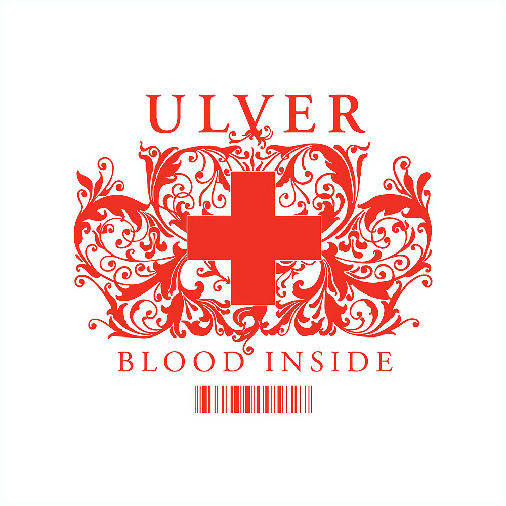

artist: **Ulver  
**release: _Blood Inside  
_format: CD, LP  
year of release: 2005, 2010  
label: [Jester](http://www.jester-records.com), [The End](http://www.theendrecords.com/), [Profound Lore](http://www.profoundlorerecords.com/)  
duration: 45:56

detailed info: [discogs.com](http://www.discogs.com/Ulver-Blood-Inside/master/10305)

I admit it, I was totally wrong about this one. A couple of years ago, when I wrote about **Ulver**'s 2007 opus [_Shadows of the Sun_](http://www.eveningoflight.nl/2007/10/01/review-ulver-shadows-of-the-sun-2007/), I claimed I didn't like _Blood Inside_ much, based upon some brief impressions from back when it came out in 2005. I guess I really didn't, at the time. But, as the wolves themselves quoted **William Blake** in 1998: "The man who never alters his opinion is like standing water, & breeds reptiles of the mind." So, when after a stellar show by the band in Tilburg last February I passed the merch stand and I saw a nice LP reissue of the album, I couldn't resist giving it another try. Whatever the reasons, it _did_ click with me this time, and for me it stands as one of the band's finest albums from now on.

Compared to most of the band's work since 2000, _Blood Inside_ is perhaps a bit difficult to get into. Gone are the soothing soundscapes and jazzy urban electronica that came before, and what we hear is a partial return to a peculiar hybrid of experimental rock and electronics that is at first quite demanding of the stylistic sorting machine inside each of us. This, though, is precisely where the strength of this album is situated: the vision and daring to make uncompromisingly original music, a quality reserved for only a select number of great names in music.

"Dressed in Black" opens up the album relatively gently, with a slowly striding rhythm, emphasising bells and cymbals, single tone synth backing and the subtly edited vocals of **Kristoffer Rygg**. Without being intrusive, many effects and instruments are piled on top of this, slowly bringing the song to an intense climax. This segues perfectly into "For the Love of God", just the first of many highlights on this album. It combines a swaggering rhythm with solid bass synth backing into a song that is incredibly innovative in style, but as catchy as any refined pop song would be. It's even got a refrain and a guitar solo...  The same goes for "Christmas", based on a poem by **Fernando Pessoa**, which ramps up the tempo and intensity a bit more. The end of this side of the LP is formed by "Blinded by Blood", a calmer track of layered ambiances, presaging the style that would come to determine much of the sound of _Shadows of the Sun_. It gives Rygg's voice some more chance to shine, and forms a moment of calm before we embark on the second half.

And that one starts with "It Is Not Sound", a track that was also used for the accompanying video on the enhanced CD release \[[YouTube](http://www.youtube.com/v/nwSjaf3aa2M)\]. The track takes a number of cues from **J.S. Bach**, in an original way that detracts neither from this track nor from the original compositions. Tradition and innovation are entwined as they were meant to here. The song moves from a rocking first half that contains the words to a coda consisting of a spacey toccata rendition in synth and drums. The album delves into even deeper and darker territories with "The Truth", which features some fast freestyle drum parts and a gloomy mood.

We're two-thirds through the tracks, and a little interlude about the lyrics might be appropriate. In contrast to the relatively simple contemplative themes on _Shadows of the Sun_ and the folkloric and religious material of the albums from the nineties, _Blood Inside_ is again a tough nut to crack. Colour plays a strong role: the virgin white and blood red are prominent, with both having particular significance in religion as well. The same goes for truth and sound, not to mention the places where god and grace are mentioned literally.

With this forethought, then, we enter the last trinity of tracks. "In the Red" is, first of all, a genuinely swinging track, again forming a perfect synthesis between cutting edge electronica, rock, and samples of music from yesterday. The way in which vintage string and brass samples are incorporated into this song is simply perfect. And then, the lyrics again. It seems we turn to the colours of this album in some of their most tangible senses: the red blood flows from our veins onto the earth, and we are rushed into a hospital. As time is running out, we are enveloped by the hospital's "great white", while the trumpets dance a final merry striptease. Our status is critical, and without sound, we try to call for help. As "Your Call" tells us, though, "no one answers the phone". This track, in its sublime interplay between soothing calm and threatening intensity, is one of the best tracks **Ulver** have ever produced, if not _the_ best. The call metaphor is expressed in the pulsating sounds of the second half of the track that pierce right to your marrow, and finally made concrete in the ringing that sounds out the track, our lifeline dangling loose in the air. Are we beyond help and is this going to be the end, or is someone going to pick up? Yes, it's the "Operator" over in emergency. Drums, bass and wild samples thunder over us as we are thrown into the last frantic rush before the end. Guitar solos and rhythmic eruptions are all over the place, as the vocals attempt to keep things together a bit, like the surgeons fighting for our life. Do we make it through in the end? Who knows... "please be patient, hold the line".

These last three tracks in themselves - the quality of the rest of the album notwithstanding - are perhaps the most important of them all. Not only do they form a virtuoso musical rendition of a desperate fight for survival in the hospital, if we take into account the broader themes of the album, we realise it might all refer to more lofty issues as well: our search for truth and meaning in life. Perhaps "truth is a hospital", and as patients, we are all struggling to survive, trying to make sense of the sounds and words, the light and dark. It is a massive feat to raise such issues in an album that manages to be musically innovative as well.

To compare _Blood Inside_ directly to **Ulver**'s other albums would be a mistake. They are all so divergent in style, and many stand as classic releases in their own playing field, having sparked a whole specific style like _[Kveldssanger](http://www.eveningoflight.nl/2009/04/29/eclipse-review-ulver-kveldssanger-1995/)_ and the other albums in _The Trilogie_, or simply by being very good, like almost all of the others. _Blood Inside_, though, might be the best in terms of forming a self-contained whole that stands miles apart from practically all other music. In this sense, it reminds me of seminal releases by industrial pioneers like **Foetus**, **Coil**, **Current 93**, and **Einstürzende Neubauten**. Thankfully, roughly twenty years after the groundbreaking releases by these bands, we are still occasionally presented with albums that push the envelope like that, though not as often as we'd like. _Blood Inside_ is definitely one of them though, a landmark in modern music.

Reviewed by **O.S.**

Tracklist:

1\. Dressed In Black (7:06)  
2\. For The Love Of God (4:11)  
3\. Christmas (6:15)  
4\. Blinded By Blood (6:23)

5\. It Is Not Sound (4:37)  
6\. The Truth (4:02)  
7\. In The Red (3:31)  
8\. Your Call (6:07)  
9\. Operator (3:37)
