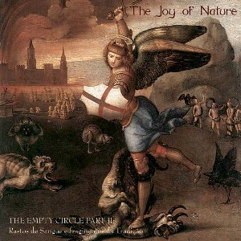

artist: **The Joy of Nature** release: _The Empty Circle Part II - Rastos De Sangue E Fragmentos Da Tradição_ format: CD year of release: 2009 label: [Ahnstern](http://www.steinklang-records.at/) duration: 64:58

detailed info: [discogs.com](http://www.discogs.com/Joy-Of-Nature-The-Empty-Circle-Part-2-Rastos-de-Sangue-e-Fragmentos-da-Tradi%C3%A7%C3%A3o/master/190964)

_Rastos De Sangue E Fragmentos Da Tradição_ is the second part of the series of _The Empty Circle_, and also the second full length by **The Joy of Nature** on **Ahnstern**. While remaining faithful to the project's unique Mediterranean neofolk sound, this particular album benefits from an emphasis on song, as well as the addition of guest musicians who bring touches of their own style to the music.

While the rich, dreamy sound of **The Joy of Nature**'s previous releases remains in place, masterfully mixing various string instruments, percussion, as well as horns, field recordings, and other sources, this album has a fresh sound to it, leaving more room for vocals and song structures to emerge, and less emphasis on almost soundscape-like compositions. A perfect example, as well as one of the best tracks on the album is "Cavalos Correm Nas Minhas Veias", a rousing uptempo track with a martial rhythm backing and a generally uplifting and battle-ready sound to it. Add to it chariot sounds, bagpipes, whistles and whatnot, and you've got an excellent track that wouldn't be out of place with a project like **Sangre Cavallum**. No surprise perhaps that **Bruno Ardo** is one of the guest musicians on this track.

There is slightly more room for more expansive tracks on the second half of the album, where experimental compositions carve out a space for themselves. We are treated to a showcase of project mastermind **Luís Couto**'s broad range of musical and vocal styles, the latter of which still aren't perfect everywhere, but this detracts little from the high level of general quality of the music on this album. Particular mention deserves to go to tracks like "Sombras Dos Nossos Ancestrais" \[Portuguese for _Shadows of Our Ancetors,_ if general linguistic knowledge doesn't fail me\], with its diverse ritual character, and "A Senhora Do Almortão E A Criança Esventrada", equally flowing and ritual, and sounding like a warmer southern European version of **Tenhi**, if you can imagine such a thing.

Coupled with themes of nature, spirituality and tradition, the music on this album is highly convincing in its combination of compact songs and extended experimental compositions. In many respects, the most mature **The Joy of Nature** album to date, and one that is certain to please lovers of Luís' earlier work, as well as lovers of experimental folk music in general.

Reviewed by **O.S.**

Tracklist:

1\. Invocação Ao Arcanjo Miguel (1:05) 2. Tanchão (3:14) 3. Terra De Lava E De Mar (4:06) 4. Ó Menino Ó (2:55) 5. Nas Veias Do Menino (2:15) 6. Cavalos Correm Nas Minhas Veias (4:03) 7. Sete Cidades (5:23) 8. Senhora Da Manhã Vitoriosa (3:48) 9. Por Tua Saudade (5:52) 10. Sombras Dos Nossos Ancestrais (6:29) 11. A Senhora Do Almortão E A Criança Esventrada (8:49) 12. Do Outro Lado Da Montanha (8:28) 13. O Cortejo Sinistro Das Sombras (5:39) 14. Para Lá Das Sombras (2:52)
