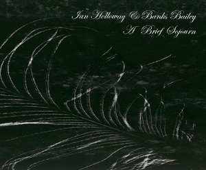

artist: **Ian Holloway** & **Banks Bailey** release: _A Brief Sojourn_ format: CDr year of release: 2009 label: [Quiet World](http://www.quietworld.co.uk/) duration: 36:24

In terms of quality releases, things have been running smoothly for Welsh drone/ambient label **Quiet World**. A recent example is _A Brief Sojourn_, a collaboration between **Banks Bailey** and **Ian Holloway**, delivering well over half an hour of finely blended drones and field recordings.

The sound on this album is most comparable to that on _Summerland_, where both men worked together with **Darren Tate**. A heavy dose of nature sounds like rain, birds, rustlings, are combined with subtle melodies, drones, and pulses, together forming a varied and atmospheric whole. The drones and weather sounds form an organic backdrop for a broad scala of unique 'voices'.

The release isn't very extreme at either end of the intensity spectrum; it maintains a stable level of layeredness and volume, without any strong eruptions of noise or silence. A perfect companion piece for a journey, a meditation or relaxation session, and the like. It's a tad dark and ominous at times, so _A Brief Sojourn_ will primarily be of interest to lovers of more obscure drone and ambient, but that goes for most of the **Quiet World** titles thus far. Compared to what went before, in any case, this one is certainly no disappointment.

Reviewed by **O.S.**

Tracklist:

1\. A Brief Sojourn (36:24)
