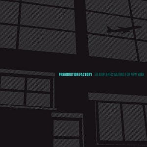

artist: **Premonition Factory** release: _59 Airplanes Waiting for New York_ format: CD year of release: 2010 label: [Longstreet](http://www.premonitionfactory.com/) duration: 50:58

detailed info: [discogs.com](http://www.discogs.com/Premonition-Factory-59-Airplanes-Waiting-For-New-York/release/2149819)

_59 Airplanes Waiting for New York_ is the debut album by **Premonition Factory**, the project of **Sjaak Overgaauw**, based in Antwerp. He self-released this album in a stylish digifile with modern design that reflects the care that went into the creation of the music as well. The album contains over 50 minutes of calm, reflective ambient based on improvised real-time looped synths.

The six tracks on this album are drifting and open, and each has a strong voice and atmosphere of its own, with some emphasising a slightly darker and more reserved tone, like "Needless To Say Anything" and "To the Dark Places Where it Leads". On the other hand, tracks like the first one are quite bright, light, and open. The title track is definitely one of the best, with its crystal clear production and gripping piano-based melodic structure, combined with soft background crackles. The last track is a very long one, ending the album gently and softly, floating away on clouds of sound.

It should come as a recommendation that **Dirk Serries** mastered this album, besides acting as a consultant for it. While it is clear that **Overgaauw** has more than enough talent to craft his own delicate soundscapes, it never hurts to have some guidance from someone with decades of experience. In this case, it means the debut **Premonition Factory** album is immediately on a very high level in terms of production and sound. As such, it comes with a very strong recommendation for all lovers of dreamy and subtle ambient music.

Reviewed by **O.S.**

Tracklist:

1\. To Those Worthy Of Honour (5:44) 2. Needless To Say Anything (9:32) 3. To The Dark Place Where It Leads (4:43) 4. The Future Will Be Whatever We Make It (5:23) 5. 59 Airplanes Waiting For New York (6:58) 6. Only Birds Know Where To Fly (18:41)
