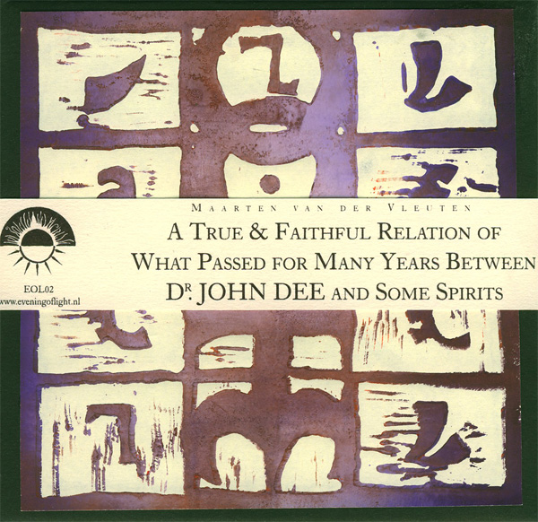
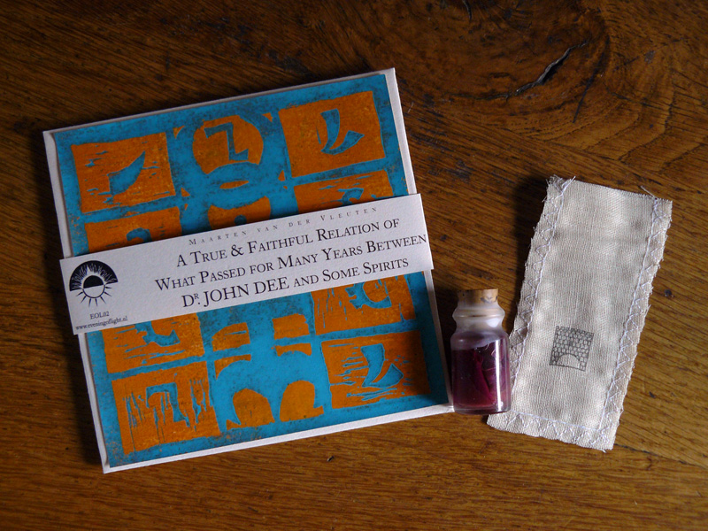

The second Evening of Light release is the new full-length album by Dutch producer **Maarten van der Vleuten**. Maarten has been active for over two decades as a producer, DJ, and composer of various forms of electronic music, ranging from techno to house, experimental, and ambient. On this latest album, he combines upbeat ritualistic ambient tracks in the vein of his album on **Tonefloat** records, _High Intolerance Towards Low Energies_, with calmer compositions, obscure drones and vocal samples. The final result reaches different levels of intensity, from the strong pace of the opening track, to the entrancing drone of "The Lamentation Over The Destruction Of Mortlake", through the techno-like beats of the penultimate track, and ending with a soothing and reflective piano-based piece. At the center of it all is the massive "The Magus", a bright and open piece of esoteric ambient.

The album was inspired by the works of **John Dee**, court consultant to Queen Elizabeth I, and one of the most prominent magi of the Elizabethan Renaissance. The esoteric theme is reflected in the music, as well as the artwork and design, which features original images from Dee's work, as well as handmade linocuts in 39 different colour schemes of Dee's _Monas Hieroglyphica_, handmade by **Phil Legard** of **Xenis Emputae Travelling Band** and **Larkfall Recordings**.

The first edition of the release is limited to 113 handmade copies, featuring artwork and notes on ivory paper, and the general packaging on black paper. Of this edition, 15 copies are part of a special edition (now sold out), entirely on ivory paper, with special lyric sheet and a phial of rose leaves and scented oil.

\[caption id="attachment\_1070" align="aligncenter" width="300"\] Limited edition (SOLD OUT)\[/caption\]

artist: **Maarten van der Vleuten** release: **[**A True & Faithful Relation of What Passed for Many Years Between Dr. John Dee and Some Spirits**](http://eveningoflight.bandcamp.com/album/a-true-faithful-relation-of-what-passed-for-many-years-between-dr-john-dee-and-some-spirits)** layout: [Phil Legard](http://www.larkfall.co.uk) duration: 7 tracks, 77:42 format: CDr release date: May 1st 2010 catalogue number: :EOL02: detailed info: [discogs.com](http://www.discogs.com/Maarten-Van-Der-Vleuten-A-True-Faithful-Relation-Of-What-Passed-For-Many-Years-Between-Dr-John-Dee-A/release/2231653) availability: Limited edition of 113 unnumbered copies. Still available. See our [order page](http://www.eveningoflight.nl/wordpress/label/ordering/) to order this release, or for more info. Also distributed by the following mailorders: [Tonefloat Records](http://www.tonefloat.com/), [Databloem](http://www.databloem.com/), [Drone Records](http://www.dronerecords.de/), [Norman Records](http://www.normanrecords.com/).

Use the player below for a sample preview of this release, containing snippets from 6 of the 7 tracks:

 [Maarten van der Vleuten - A True & Faithful Relation...](http://soundcloud.com/eveningoflight/maarten-van-der-vleuten-a-true) by [Evening of Light](http://soundcloud.com/eveningoflight)

Video by Maarten van der Vleuten for the track "A Vision: The Garden of Comfort":

**Reviews & Press:**

\-Played on [KinkFM, X-rated](http://www.kinkfm.com/programma/X-Rated) -Played on [KX Radio](http://www.kxradio.nl/), La Vie en Roose -Featured on [VPRO Radio 6, Cafe Sonore](http://cafesonore.radio6.nl/tag/maarten-van-der-vleuten/)

**Links:**

[Maarten van der Vleuten (Official Site)](http://www.maartenvandervleuten.com/) [Maarten van der Vleuten (MySpace)](http://www.myspace.com/maartenvandervleuten)

[Phil Legard / Larkfall](http://www.larkfall.co.uk)
