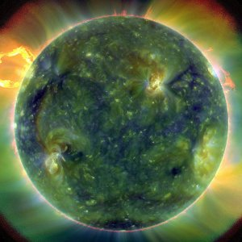

[Evening of Light Cloudscape #1 : April 2010](http://www.mixcloud.com/eveningoflight/evening-of-light-cloudscape-1-april-2010/?utm_source=widget&utm_medium=web&utm_campaign=base_links&utm_term=resource_link) by [Evening Of Light](http://www.mixcloud.com/eveningoflight/?utm_source=widget&utm_medium=web&utm_campaign=base_links&utm_term=profile_link) on [Mixcloud](http://www.mixcloud.com/?utm_source=widget&utm_medium=web&utm_campaign=base_links&utm_term=homepage_link)

00:17 | **Celestiial** | Spell over Still Water | _[Where Life Springs Eternal](http://www.eveningoflight.nl/2010/07/17/review-celestiial-where-life-springs-eternal-2010/ "Review: Celestiial – Where Life Springs Eternal (2010)") |_ 2010 04:13 | **Machinist** | III | _Viens avec Moi dans le Vide_ | 2010 12:00 | **The Gray Field Recordings** | In Milky Twilight| _[The Weaver's Daughter](http://www.eveningoflight.nl/2009/09/03/review-the-gray-field-recordings-the-weavers-daughter-2009/ "Review: The Gray Field Recordings – The Weaver’s Daughter (2009)") |_ 2009 16:06 | **Ashberry** | Myra | _Resin_ | 2009 23:12 | **The Magickal Folk of the Faraway Tree** | My Lodging it Is on the Cold Ground _| [The Soup & The Shilling](http://www.eveningoflight.nl/2010/04/30/review-the-magickal-folk-of-the-faraway-tree-the-soup-the-shilling-2010/ "Review: The Magickal Folk of the Faraway Tree – The Soup & The Shilling (2010)")_ | 2010 26:16 | **Yawning Chasm** | Monsters | _[The Shadow Is That Hidden](http://www.eveningoflight.nl/2010/05/31/review-yawning-chasm-that-shadow-is-that-hidden-2009/ "Review: Yawning Chasm – That Shadow Is That Hidden (2009)")_ | 2009 29:54 | **Premonition Factory** | 59 Airplanes Waiting for New York | _[59 Airplanes Waiting for New York](http://www.eveningoflight.nl/2010/04/21/review-premonition-factory-59-airplanes-waiting-for-new-york-2010/ "Review: Premonition Factory – 59 Airplanes Waiting for New York (2010)")_ | 2010 36:20 | **Artefactum |** Rosa Rubea | _Sub Rosa_ | 2008 42:00 | **Tervahäät** | Hauta | _[Tervahäät](http://www.eveningoflight.nl/2010/02/18/review-tervahaat-2009/ "Review: Tervahäät (2009)")_ | 2009 46:44 | **Locrian** | Obsolete Elegy in Cast Concrete | _Drenched Lands_ | 2009 53:12 | **Einstürzende Neubauten** | Yü-Gung (Fütter Mein Ego) | _Halber Mensch_ | 1985
