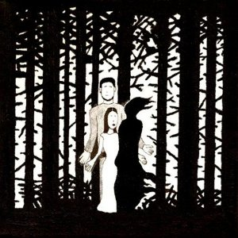

artist: **The Magickal Folk of the Faraway Tree** release: _The Soup & The Shilling_ format: 2xCD year: 2010 label: Deadslackstring / Deserted Village duration: 74:58

detailed info: [discogs.com](http://www.discogs.com/Magickal-Folk-Of-The-Faraway-Tree-The-Soup-The-Shilling/release/2253849)

It's been a wait of over five years, but for those who've - like me - been looking forward to a re-release of the first two EPs by **The Magcikal Folk of the Faraway Tree**, the moment is here. Even better, we get a whole new album thrown into the bargain. If you're unfamiliar with the band, it's best introduced as the traditional folk outlet of the good people from the **Deserted Village** collective in Ireland. It's a bit vague who the exact contributors to the band are, but it's clear that **Deserted Village** mainstays **David Colohan** and **Gavin Prior** are among them.

CD 1 contains the aforementioned EPs, _The Mildew Leaf_ (2003) and _The Cat's Melodeon_ (2005), both of which were highly limited releases. Separating the two is the beautiful "Being Here Has Caused My Sorrow", from the _Gold Leaf Branches_ compilation put out by **Digitalis** a while back. Both contain a very nice selection of (mostly) British and Irish traditional folk tunes, performed as if straight from some countryside pub, which isn't even that unlikely considering the nomadic characters that generally make up **Deserted Village**. The performance isn't perfectly polished everywhere, but that has never been something to daunt genuine folk enthusiasts. Among the many great tracks on these EPs are some beautiful Gaelic songs ("In Aimsir Bhaint An Fhéir"), rousing battle anthems ("Trelawny"), sea shanties ("The Mermaid"), and tragic ballads ("Daybreak").

The second half of this release contains fourteen unreleased tracks, basically in the same style as what we've heard before. The selection of songs is excellent, and contains a mixture of moods comparable to that on the EPs. "An Bhanaltra" opens with soft guitar and flute lines and Gaelic text. Some more uptempo work is also found, such as "Locks and Bolts" and especially "Up to the Rigs", a scoundrel anthem if there ever was one. On the other hand, the melancholic and reflective side of folk music represented by beautiful tracks such as "Going to Mass Last Sunday" and a touching rendition of "My Lodging it Is on the Cold Ground".

Apart from the rather sober presentation - the cover drawing and pictures don't really come out well - this release is filled with loveliness. There's a perfect balance of different kinds of folk songs that should appeal to any lover of traditional interpretations, with a lingering presence of the experimental tendencies of the **Deserted Village** collective.

Reviewed by **O.S.**

Tracklist:

_The Mildew Leaf_ 1.1 In Aimsir Bhaint An Fhéir (2:41) 1.2 Spencer The Rover (3:43) 1.3 Le Bon Marain (3:35) 1.4 The Blackthorn Tree (2:09) 1.5 Twa Corbies (1:40) 1.6 Is Iomaidh Coiscéim Fada (3:23) 1.7 Time To Go Home (1:54)

1.8 Being Here Has Caused My Sorrow (4:25)

_The Cat's Melodeon_ 1.9 Trelawny (4:07) 1.10 The Mermaid (1:56) 1.11 Caol Is Eadar Mí Is Iain (0:41) 1.12 Daybreak (1:52) 1.13 Donal Óg (3:29) 1.14 Mrs Cudmore's Air (0:44) 1.15 Here's A Health To All True Lovers (2:44)

2.1 An Bhanaltra (4:50) 2.2 Cambourne Hill (0:49) 2.3 Trois Jeunes Tambours (2:14) 2.4 I Binged Avree (1:00) 2.5 Blackbirds And Thrushes (2:16) 2.6 Locks And Bolts (2:28) 2.7 She Was A Rum One (3:00) 2.8 My Lodging It Is On The Cold Ground (3:09) 2.9 The Summer Will Come (1:16) 2.10 Going To Mass Last Sunday (3:19) 2.11 The Deluded Lover (3:09) 2.12 Up To The Rigs (2:29) 2.13 The Cat's Melodeon (2:27) 2.14 The Haselbury Girl (3:29)
