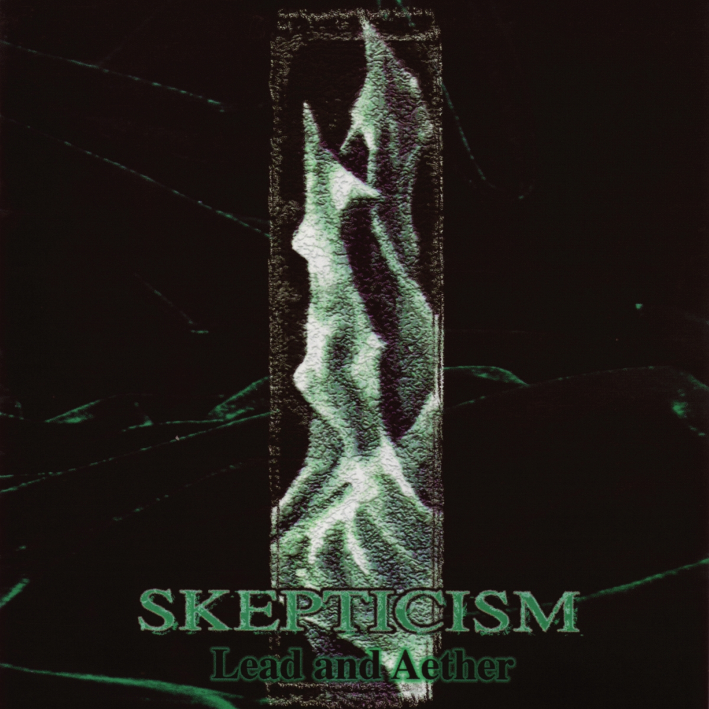

artist: **Skepticism  
**release: _Lead and Aether  
_format: CD  
year of release: 1997  
label: [Red Stream](http://www.redstream.org/)  
duration: 47:46

detailed info: [discogs.com](http://www.discogs.com/Skepticism-Lead-And-Aether/master/65403)

A lot of alternative music is very specific to a certain scene, genre, or style, where the rules are clear and everyone – that is, the insiders – knows what to expect. Sometimes, though, albums are released that, while informed of the rules, don't exactly play by them. The result can be interesting and innovative music that defies, at least to a certain degree, traditional genre boundaries.

One such album is _Lead and Aether_ by Finland's **Skepticism**. Originally released in 1997, it was the band's second full length album. In many respects, it builds on musical foundations laid in their 1995 debut _Stormcrowfleet_; at its core, the band's music is rooted in heavy metal, and more particularly the crossovers between doom and death metal that came into being in the early nineties. They pioneered what would become known as funeral doom, characterised by its solemn and mournful atmosphere, and taking to the extreme the doom metal axiom of "slow and low".

While **Skepticism** have been at the forefront of this style, and hugely influential on later bands, the unique sound created in these early works stands by itself. More so than practically every other band in this movement, **Skepticism** managed to modify the traditional metal band setup and sound, and create music that has recognisable roots, but a crown that explores new skies. In principle a quartet, the music is based on drums, guitar, synth/organ, and vocals. The bass guitar is absent, and while distorted and modified, the electric lead guitar is less dominant than in most other metal music. Instead, the synth and organ provide a deeper layer to the music. The drums, played on kettles at least one size bigger than most usual setups, are true to the genre but with an original execution: slow, solemn, with an emphasis on subtle timpani-like percussion and swirling cymbals. The vocals, finally, are a death metal growl obscured to a point where it often resembles a surge of breath or a wave, rather than anything more sinister.

Apart from original instrumentation, the album offers the listener a great deal in terms of structure and songwriting. It opens with the final organ chords of the introductory EP _Ethere_, and launches into "THE ORGANIUM", a deep piece as heavy as its typography, that introduces the two central lyrical themes of the album: metal and air, an alchemical whole that ties many elements of the music together. Air and metal are what powers and constitutes the organ, and it also represents the heavy and light in the music, solidity and evanescence.

The second track, a reworked version of the one that appeared on _Ethere_, is "The March and the Stream", one of funeral doom's canonical songs. Indeed, of this album, it is this mournful masterpiece that lies closest to the stylistic norm of genre. How different, then, is "The Falls", a masterpiece in its own right. It is mystical, hopeful, deep, expressing directions of thought (wandering, hope, despair, introspection, mysticism) in the lyrical guise of three different (water)falls. The music itself is of an elegant simplicity, perfectly balancing different guitar and synth sounds, flowing drums, and vocals like drifting clouds. Central to the song is a delicate melody, doubled and shifted, positioned so greatly that it sucks you deeper into the song, which ends in a way that is as majestic as it is emotionally ambiguous.

The second half of the album contains much to enjoy as well. There's the once more aptly named "Forge", a powerful rolling track that really sounds like the inside of an alchemical metal workshop. "-Edges-" is more obscure, emphasising floating melodies and atmospheres that are more esoteric than any else. "Aether", finally, is calm and serene most of the time, bringin the album to a most satisfying conclusion.

There are a couple of factors that make _Lead and Aether_ a hugely important album. First of all, it shows the band at the pinnacle of its craft. The debut album pioneered **Skepticism**'s sound, but this one combined it with more sophisticated songwriting, eclipsing that of much of their later work, with some exceptions. It also, along with surrounding releases, proved massively influential for the small but not insignificant funeral doom genre. Most importantly, though, it shows how a genre's (in this case heavy metal's) basic assets can be taken, hammered, forged, transformed, yielding wholly new results and a different listening experience. It's base metal, aether, and somewhere in the grey mists, a hint of gold.

Reviewed by **O.S.**

Tracklist:

1\. THE ORGANIUM (6:41)  
2\. The March And The Stream (10:35)  
3\. The Falls (8:43)  
4\. Forge (5:50)  
5\. -Edges- (6:11)  
6\. Aether (9:49)
