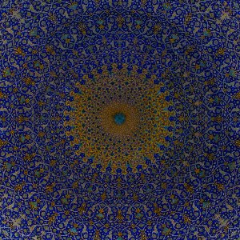

[Evening of Light Cloudscape #2 : May 2010](http://www.mixcloud.com/eveningoflight/evening-of-light-cloudscape-2-may-2010/?utm_source=widget&utm_medium=web&utm_campaign=base_links&utm_term=resource_link) by [Evening Of Light](http://www.mixcloud.com/eveningoflight/?utm_source=widget&utm_medium=web&utm_campaign=base_links&utm_term=profile_link) on [Mixcloud](http://www.mixcloud.com/?utm_source=widget&utm_medium=web&utm_campaign=base_links&utm_term=homepage_link)

00:07 | United Bible Studies | The Swallowing | The Jonah | 2009 03:38 | Inalonelyplace | Little Black Heart | Unrequited Creatures of Beauty | 2009 05:46 | The Driftwood Manor | The Lasting Final Hurt | [The Same Figure, Leaving](http://www.eveningoflight.nl/2010/09/24/retrospective-the-driftwood-manor-three-2010-releases/ "Retrospective: The Driftwood Manor, three 2010 releases") | 2010 08:40 | Richard Skelton | Green Withins Brook | Landings | 2009 12:38 | Woodpecker Wooliams | In Your Mouth | [Diving Down](http://www.eveningoflight.nl/2009/11/18/review-woodpecker-wooliams-diving-down-2009/ "Review: Woodpecker Wooliams – Diving Down (2009)") | 2009 17:08 | :Golgatha: & Dawn & Dusk Entwined | The Messiah | Sang Graal | 2008 22:29 | Karjalan Sissit | Har Du Horat Runt På Campingen? | [Fucking Whore Society](http://www.eveningoflight.nl/2009/11/03/review-karjalan-sissit-fucking-whore-society-2009/ "Review: Karjalan Sissit – Fucking Whore Society (2009)") | 2009 26:23 | Richard Moult | Swaermian | [Ethe](http://www.eveningoflight.nl/2010/03/09/review-richard-moult-ethe-2010/ "Review: Richard Moult – Ethe (2010)") | 2010 33:57 | Xenis Emputae Travelling Band | Chapel of Infinite Echo | The Hieroglyphic Mountain | 2004 48:57 | Skepticism | The Falls | [Lead and Aether](http://www.eveningoflight.nl/2010/05/09/eclipse-review-skepticism-lead-and-aether-1997/ "Eclipse Review: Skepticism – Lead and Aether (1997)") | 1997
