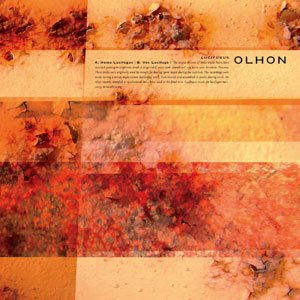

artist: **Olhon** release: _Lucifugus_ format: 10" year of release: 2009 label: [Substantia Innominata](http://www.substantia-innominata.de/) duration: 24:05

detailed info: [discogs.com](http://www.discogs.com/Olhon-Lucifugus/release/1877151)

The sound of metal has been a staple in industrial music and its offshoots for around four decades now. And no wonder, there is something evocative and imminent about its clanging, scraping, and tolling. On this 10", the **Olhon** duo, consisting of **Massimo Magrini** (**Bad Sector**) and **Zairo** (**Where**), explore the unique acoustics of a large (abandoned) water tank previously used for mining industries. All sounds on this EP were recorded in and from the tank "during a windy night in late September 2007", resulting in two long soundscapes with a very coherent sound.

"Homo Lucifugus" graces the main side of this release, focusing on eerie aerial sound, subtle drones, and errattic metal percission. **Olhon** resists the temptation to stuff these soundscapes chock full of layers, opting instead for a rather open sound design where you can clearly pick out every element at all times. This lends the sound a subtlety that encourages attentive listening, and it really allows the unique sound of the water tank to surface.

The B-side, "Vox Lucifuga" contains a bit more distortion and noise, particularly in the middle part of the track, raising the intensity level of the release somewhat by this point. The effect is more that of metal scraping directly in your brain, rather than the convoluted sound of collapsing metal structures that is also audible quite often in music like this. Following is a section that returns to the eeriness that pervades a great part of this release: howling abstract winds, soft rustling and jangling, and deep drones, all softly receding towards the ending of this release.

Because of its unique sound source and well-crafted production, _Lucifugus_ is a very successful and satisfying piece that will be interesting to many lovers of ambient, drones and abstract music. The fact that it is lovingly released as part of the **Substantia Innominata** series, with suitable artwork and orange vinyl, only adds to its appeal.

Reviewed by **O.S.**

Tracklist:

A Homo Lucifugus (12:01) B Vox Lucifuga (12:04)

http://www.substantia-innominata.de/
