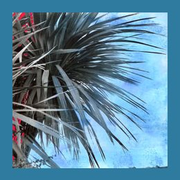

artist: **Yawning Chasm** release: _The Shadow Is That Hidden_ format: 3" CDr year of release: 2009 label: [Rusted Rail](http://www.rustedrail.com) duration: 20:46

detailed info: [discogs.com](http://www.discogs.com/Yawning-Chasm-The-Shadow-Is-That-Hidden/release/2254020)

One of the latest in the highly recognisable series of 3" EPs put out by Irish label **Rusted Rail** is this new one by **Yawning Chasm**, the solo project of **Aaron Coyne**, who is also one half of **Mirakil Whip**.

Six lo-fi singer/songwriter tracks make up this release, centered around voice and guitar, both well-covered in effects, resulting in dreamy, eerie folk songs with flowing circular melodies. It's music that will definitely appeal to you if you fancy the sound of, for example, labelmates **Phantom Dog Beneath the Moon**, or other purveyors of ghostly modern folk tunes.

Though each song had its own charm, as a whole the EP is not immediately very impressive or original. However, depending on your mood and surroundings, these songs can definitely hit the right spot. Sitting in the train, with the summer sun in your face, the landscape zipping by, it works perfectly in several parts.

Not something to buy blindly, but if your interest is piqued do give it a listen. **Rusted Rail** EPs generally hold something nice for the sympathetic ear.

Reviewed by **O.S.**

Tracklist:

1\. To The Void (2:28) 2. Stars Are Going Out (2:43) 3. Tumble River (4:02) 4. Monsters (3:54) 5. Your Bones Will Bleach White (3:48) 6. Distant Fires (3:51)
