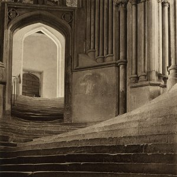

[Evening of Light Cloudscape #3: June 2010](http://www.mixcloud.com/eveningoflight/evening-of-light-cloudscape-3-june-2010/?utm_source=widget&utm_medium=web&utm_campaign=base_links&utm_term=resource_link) by [Evening Of Light](http://www.mixcloud.com/eveningoflight/?utm_source=widget&utm_medium=web&utm_campaign=base_links&utm_term=profile_link) on [Mixcloud](http://www.mixcloud.com/?utm_source=widget&utm_medium=web&utm_campaign=base_links&utm_term=homepage_link)

 00:07 | Wolves in the Throne Room | Dea Artio | Two Hunters | 2007 05:50 | Sieben | Build You a Song | [Star Wood Brick Firmament](http://www.eveningoflight.nl/2010/08/22/review-sieben-star-wood-brick-firmament-2010/ "Review: Sieben – Star Wood Brick Firmament (2010)") | 2010 10:24 | Agitated Radio Pilot | The Drunken Poet | [A Field Day](http://www.eveningoflight.nl/2009/10/26/new-agitated-radio-pilot-ep-on-rusted-rail/ "New Agitated Radio Pilot EP on Rusted Rail") | 2009 12:44 | The A. Lords | Toy Piano, Balalaika | [The A. Lords](http://www.eveningoflight.nl/2008/02/01/review-the-a-lords-2006/ "Review: The A. Lords (2006)") | 2006 14:39 | In Ruin | Fragmented Hearts | [A Ghost To Be Forgotten](http://www.eveningoflight.nl/2008/03/01/review-in-ruin-a-ghost-to-be-forgotten-2008/ "Review: In Ruin – A Ghost To Be Forgotten (2008)") | 2008 19:00 | The Joy of Nature | Cavalos Correm nas Minhas Veias | [The Empty Circle Part II](http://www.eveningoflight.nl/2010/04/04/review-the-joy-of-nature-the-empty-circle-part-ii-rastos-de-sangue-e-fragmentos-da-tradicao-2009/ "Review: The Joy of Nature – The Empty Circle Part II – Rastos De Sangue E Fragmentos Da Tradição (2009)") | 2009 22:56 | Troum | Procession | [Eald-Ge-Stréon](http://www.eveningoflight.nl/2009/11/10/review-troum-eald-ge-streon-2009/ "Review: Troum – Eald-Ge-Stréon (2009)") | 2009 27:15 | Vägskäl | Deep Inside | [This Could've Been the Beginning of Something Great](http://www.eveningoflight.nl/2008/04/01/review-vagskal-this-couldve-been-the-beginning-of-something-great-2007/ "Review: Vägskäl – This Could’ve Been the Beginning of Something Great (2007)") | 2007 30:40 | Ctephin | \[hell\]: Precipice of Origin | [DUAD](http://www.eveningoflight.nl/2010/06/28/review-ctephin-duad-2009/ "Review: Ctephin – DUAD (2009)") | 2009 36:15 | Mendel Kaelen | Light of Nature | [Remembering What Was Forgotten](http://www.eveningoflight.nl/2010/07/30/review-mendel-kaelen-remembering-what-was-forgotten-2010/ "Review: Mendel Kaelen – Remembering What Was Forgotten (2010)") | 2010 46:08 | Far Black Furlong | Three & Four | [Far Black Furlong](http://www.eveningoflight.nl/2008/01/01/review-far-black-furlong-far-black-furlong-haidd-2-2007/ "Review: Far Black Furlong – Far Black Furlong / Haidd 2 (2007)") | 2007 59:40 | Nico | Evening of Light | The Marble Index | 1968
