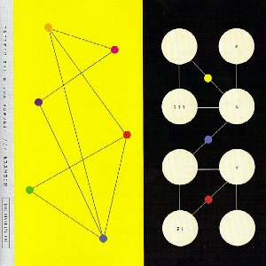

artist: **Pacific 231** & **Vox Populi!** release: _Aramesh_ format: CD year of release: 2009 label: [Rotorelief](http://www.rotorelief.com/) duration: 64:40

detailed info: [discogs.com](http://www.discogs.com/release/1848353)

_Aramesh_ is a collaboration between two artists who have been active in the French industrial underground since the early 1980s, to wit **Vox Populi!** and **Pacific 231**. This was my first encounter with either of them, but one that definitely whet my appetite for more of their work.

Me being new to the music of these projects, I can't say anything about how it relates to their earlier works throught the past three decades. Where they've arrived now, though, is a fascinating area of experimental music where ambient meets industrial, psychedelic music, and ethnic influences. The album is very song oriented, varying widely in intensity and colour over each of the sixteen tracks. Some tracks are very short, others hit the ten minute mark, so there is a lot of variation to be found, without any clear overarching pattern that is forced upon the listener. Rather, it seems we are invited to take the album in piecemeal, or in random order.

Taken in that fashion, _Aramesh_ is a wonderful album, surprising in its diversity and its open sound. Most of the sound comes from synths, noises, and drones, but there is a lot of percussion floating around, some vocals, flute, you name it. This is one to take in lying back, headphones on, the sun in your face, perhaps some good scents and intoxicants floating around... you're in for one good trip.

Reviewed by **O.S.**

Tracklist:

1 Ajr (4:34) 2 Dumai (3:34) 3 Gharb (4:51) 4 Loomhe (1:08) 5 Sawt (5:24) 6 Waartve (10:00) 7 Chamal (5:15) 8 Berz (2:15) 9 Janub (2:17) 10 Mumb (0:58) 11 Alif (2:13) 12 Asas (4:42) 13 Dumai (3:31) 14 Maktum (3:31) 15 Ubub (8:37) 16 Inzur (1:50)
