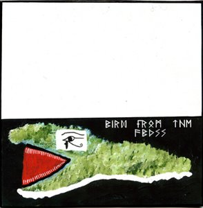

artist: **Bird from the Abyss** release: _I_ format: CDr year of release: 2009 label: Self-released duration: 13:08

detailed info: [discogs.com](http://www.discogs.com/Bird-From-The-Abyss-I/release/1850712)

This Finnish one-man project by **J.N. Aaltonen** presented _I_, its debut release, in 2009, unleashing on the world its obscure ritual sounds. In practice, _I_ is halfway between a demo and a first EP, with quaint homemade presentation, but music that is promising and interesting, but in need of a little more polish.

Ritual music, as I said, and executed mostly with acoustic string instruments, assorted percussion, supported by some bass rumblings and heavy guitars at times. Melodies and rhythms turn back upon themselves in repeating patterns, forming the musical basis for the ritual nature of this work.

Added to this is a fascinating and almost uniquely Finnish thematic whole, incorporating folklore, shamanism, esotericism, and dark mythology. As a whole, the music is certainly original enough, though with pleasant echos of others (Finnish) sounds from experimental folk and (post-)industrial music. However, it does lack a certain refinement and development that could have made these short tracks more imminent and expressive.

No doubt, that will come later with **Bird from the Abyss**' next efforts, for there is no reason why we shouldn't look forward to new material. Until then, this is a nice underground release, recommended to check if you liked, for example, **Tervahäät**.

Reviewed by **O.S.**

Tracklist:

1\. Intro / Beginning At Center Of The Chaos / Azathoth And Flute (1:54) 2. Song To The Great Black Fox (2:13) 3. Ways Of Slaughter (3:34) 4. Abdul Alhazred's Anxiety (5:22)
