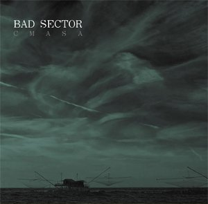

artist: **Bad Sector** release: _CMASA_ format: CD year of release: 2009 label: [Power and Steel](http://www.loki-found.de/) duration: 40:00

detailed info: [discogs.com](http://www.discogs.com/Bad-Sector-Cmasa/release/1809725)

According to the liner notes, _CMASA_ is an unusual album for **Massimo Magrini**, working as **Bad Sector**. Be that as it may, it is certainly not one without merit. This more or less conceptual album centered around the abandoned airplane factory CMASA is a varied piece of melodic dark ambient.

The sounds for this album were taken from pieces created by Magrini for the M3M exhibition in Pisa, 2005. On the one hand, field recordings - mostly sounds of metal and water - feature prominently. On the other hand, there are large roles for acoustic guitar and piano melodies, apart from the usual ambient electronics. In keeping with the theme, the meeting of river and sea, a lot of sounds on this album evoke dripping, flowing, waves and surges.

Considering all this, _CMASA_ is a very successful album, offering a pleasant variety of sounds with a coherent tone and colour. The focus on a concrete concept and pleasant though mysterious melodies makes it an accessible album as well. The quick switches between sound elements comes across a bit haphazard or superficial at times, but that doesn't keep it from being a thoroughly enjoyable release.

Reviewed by **O.S.**

Tracklist:

1\. Entrance (2:00) 2. CMASA 1/3 (12:00) 3. CMASA 2/3 (12:00) 4. CMASA 3/3 (12:00) 5. Exit (2:00)
