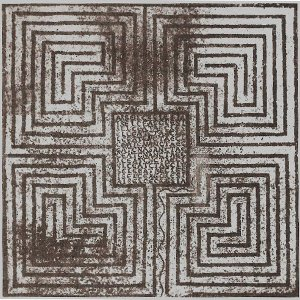

[Cloudscape #4: July 2010](http://www.mixcloud.com/eveningoflight/cloudscape-4-july-2010/?utm_source=widget&utm_medium=web&utm_campaign=base_links&utm_term=resource_link) by [Evening Of Light](http://www.mixcloud.com/eveningoflight/?utm_source=widget&utm_medium=web&utm_campaign=base_links&utm_term=profile_link) on [Mixcloud](http://www.mixcloud.com/?utm_source=widget&utm_medium=web&utm_campaign=base_links&utm_term=homepage_link)

00:09 | **Sol Invictus** | The Bad Luck Bird | [_The Bad Luck Bird_](http://www.eveningoflight.nl/2010/06/19/review-sol-invictus-the-bad-luck-bird-2010/ "Review: Sol Invictus – The Bad Luck Bird (2010)") | 2010 03:41 | **The Driftwood Manor** | Bury Me Alive | [_Holy Ghost_](http://www.eveningoflight.nl/2010/09/24/retrospective-the-driftwood-manor-three-2010-releases/ "Feature: The Driftwood Manor, three 2010 releases") | 2010 07:42 | **Phantom Dog Beneath the Moon** | Poems | [_The Trees, the Sea in a Lunar Stream_](http://www.eveningoflight.nl/2010/08/11/review-phantom-dog-beneath-the-moon-the-trees-the-sea-in-a-lunar-stream-2010/ "Review: Phantom Dog Beneath the Moon – The Trees, The Sea in a Lunar Stream (2010)") | 2010 14:03 | **Waldteufel** | Traumpfad | _Sanguis_ | 2007 22:41 | **Martyn Bates** | Trade Winds | [_Mystery Seas (Letters Written #2)_](http://www.eveningoflight.nl/2007/08/07/eclipse-review-martyn-bates-mystery-seas-letters-written-2-1995/ "Eclipse Review: Martyn Bates – Mystery Seas (Letters Written #2) (1995)") | 1995 25:06 | **Ruhr Hunter** | Waniyetu Wintruz | _By the Hum of Ullr's Bow_ | 2009 33:08 | **Diamanda Galás** | Deliver Me From Mine Enemies | _The Divine Punishment_ | 1986 35:51 | **Diamanda Galás** | We Will Not Accept Your Quarantine | _The Divine Punishment_ | 1986 38:07 | **Wilt** | Hemophilic Root Plow | _Graveflowers_ | 2004 46:00 | **Nadja & Troum** | Dominium Visurgis Part 2 | _Dominium Visurgis_ | 2010 58:12 | **Ulver** | Your Call | [_Blood Inside_](http://www.eveningoflight.nl/2010/03/16/eclipse-review-ulver-blood-inside-2005/ "Eclipse Review: Ulver – Blood Inside (2005)") | 2005
