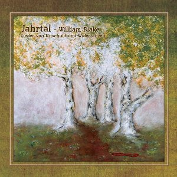

artist: **Jahrtal** release: _William Blake - Lieder Von Unschuld Und Widerfahren_ format: CD year of release: 2009 label: [Ahnstern](http://www.steinklang-records.at/) duration: 57:57

detailed info: [discogs.com](http://www.discogs.com/Jahrtal-William-Blake-Lieder-Von-Unschuld-Und-Widerfahren/master/190965)

Austrain **Ewald Spiss** and his project **Jahrtal** has been active the past year in developing his own take on alternative folk, resulting in the release of several albums recently. One of them is this one, released by **Ahnstern**, a setting of ten poems by **William Blake** from _Songs of Innocence and Experience_.

In terms of style, Spiss remains quite close to the German neofolk from around the turn of the millennium like **Orplid** and **Forseti**. This means an emphasis on calm, fingerpicked acoustic guitar melodies, soft male and female vocals, and the addition of support instruments like flute and fiddle here and there. **Jahrtal** adds to this a pleasant touch of Indian instruments in some places.

The problem with this kind of neofolk is that it runs the risk of becoming kitschy at times, like a number of other German genres. On the whole, the music on this album is somewhat tame, seeming to express in sound only the first stage of Blake's lyrical diptych. The strong contrast between Unschuld and Widerfahren could have been emphasised more strongly with a twist in the music halfway, with a more satisfactory result.

That said, the music is very relaxing, and Spiss' translations of the poems are very elegant. As such, this is an album that will please enthusiasts of this particular calm and pastoral neofolk style, as well as those who collect musical settings of Blake's writings.

Reviewed by **O.S.**

Tracklist:

_Lieder Von Unschuld_

1\. Eingang - Der Pfeifer (4:15) 2. Das Hallende Grün (5:55) 3. Nacht (8:51) 4. Frühling (4:58) 5. Wiegenlied (7:14)

_Lieder Vom Widerfahren_

6\. Eingang - Der Erde Antwort (5:41) 7. Mein Hübscher Rosenstrauch (3:06) 8. Das Schulkind (5:47) 9. Kleines Verlorenes Kind (7:01) 10. Ach! Sonnenblume (5:060
