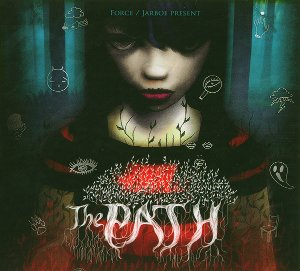

artist: **Kris Force** & **Jarboe** release: _The Path_ format: CD year of release: 2010 label: [Paradigms](http://www.paradigms-recordings.com/) duration: 66:01

detailed info: [discogs.com](http://www.discogs.com/release/2286386)

Artists active in different media working together on new concepts often achieve fascinating results where they complement each other's forms of expression. Soundtracks are a perfect example of this, where music and sound design ideally works in tandem with the audiovisual experience of a film, or in this case, a digital video game. _The Path_ was developed by Belgian independent digital artists **Auriea Harvey** and **Michaël Samyn,** publishing their work under the name [**Tale of Tales**](http://tale-of-tales.com/ThePath/). The game was published in early 2009, and went on to inspire strong reactions in the international gamer press and communities. If baffled or infuriated some people who were unable to deal with its unstreamlined gameplay and its controversial and challenging thematic content. At the same time, many people were won over by the game's powerful vision and atmosphere, as well as its psychological power.

In short, _The Path_ is about girls growing up through traumatic and life-shaping experiences. This psychological premise is cast in a surrealistic game of exploration and horror, wherein the player guides six incarnations of Little Red Riding Hood (ranging in age from 9 to 19) through the forest towards Grandmother's House, or towards their doom: the Wolf. Undertones of death, loss, illness, self-destruction, sex, nostalgia, and trauma abound in _The Path_, which is not for the faint of heart. Ultimately, though, I believe it is a life-affirming and powerful experience, and a testament to the possibilities of digital art as a medium.

The game's artistic success has a lot to thank to its aural components, which is why it's very nice that the soundtrack was released separately this year. Working together here are two women with their own unique place in the history of alternative music. **Jarboe** we know, of course, from her period playing with **Swans** and her extensive solo and collaborative works. **Kris Force** plays with **Amber Asylum**, and has collaborated with **Tony Wakeford** on great releases by **The Triple Tree** and **Grey Force Wakeford**, for example. Together they have crafted a musical score that is the perfect underpinning of the unsettling themes in this game, using a variety of acoustic instruments, vocal styles, and digital effects and samples.

Partly, the music and the game draw upon the horror trope of juxtaposing the world of the child with that of the adult. Thus, like the game confronts the youngest Little Red with a graveyard-roaming Werewolf, so the childish melodies and innocent voices clash with dark ambiances, harsh distortion, and deep rumblings in the soundtrack. In general, though, the music presents a variety of themes forming a stylistically coherent whole.

Of particular note are the sweeping violin-based "Forest Theme", which is a bit overused in the game, as well the wolf themes that accompany key climatic passages in the game. Each of these perfectly accentuates the feelings connected to the wolf encounters, from the classic horror of the "Werewolf", church bells and all, through to the sad theme of "Fey Wolf", who seals the doom of the eldest girl with its piano strings. In between there are the calm mysticism of "Cloud Wolf", the lost childhood of "Girl in Red", the urban theme of "Charming Wolf", with engines and smoke, and the relentless chops and moans of "Woodsman Wolf".

Also wonderful, as well as unique to this soundtrack because they're not in the game - for obvious reasons - are **Jarboe**'s retellings of two different versions of the tale of Little Red Riding Hood. There's "Grandmother's Tale", which reveals the tale's strong sexual undertones, and "Little Red Riding Hood", which will be closer to the version of the tale which most of us will have heard as a child; without the happy ending, that is.

I can imagine this CD won't be totally impressive without having actually experienced the game, which can be an issue for many musical scores. One needs the context to fully enjoy the music. That said, this is all the more reason to take a look at the game as well as the soundtrack, for both together stand for a unique work of modern art, fusing folklore, horror, feminine psychology, and experimental music in a masterful way.

Reviewed by **O.S.**

Tracklist:

1\. Safe Song - The Path (2:38) 2. Forest Theme (7:03) 3. Little Girls (1:03) 4. Charming Wolf (3:26) 5. Fey Wolf (4:59) 6. Forest Interlude 1 (1:27) 7. Woodsman Wolf (3:25) 8. Werewolf (5:58) 9. Girl In Red (3:15) 10. Forest Interlude 2 (4:06) 11. Grandmother's tale (7:17) 12. Cloud Wolf (6:54) 13. Epilogue (5:20) 14. Little Red Riding Hood (5:58) 15. Forest Reprise (2:21) 16. EAT (0:51)
