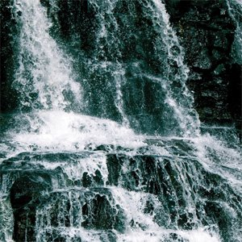

artist: **Celestiial** release: _Where Life Springs Eternal_ format: CD year of release: 2010 label: [Bindrune](http://bindrunerecordings.com/) duration: 56:24

detailed info: [discogs.com](http://www.discogs.com/Celestiial-Where-Life-Springs-Eternal/release/2254208)

Some young artists have the strength of character to build on the influence of their forebears, without losing themselves in either dull imitation or empty rebellion. There is a fine balance where elements from the past are put to use in expressing a new, and above all, personal musical vision. **Tanner Anderson**'s brainchild **Celestiial** (here assisted by **Timothy Glenn** and **Jason Walton**) is such a vision, using the raw materials of heavy metal to forge soundscapes that express the energies inherent in nature.

_Where Life Springs Eternal_ is the second full length album of this project, and it elaborates subtly on the style of 2006's _Desolate North_. "Spell Over Still Water" starts the album with deep guitar drones, heavy weather field recordings and the penetrating screech of bowed cymbals. The second track is the main carrier of this album, thrusting up wave after wave of obscure guitar chords and reverb-drenched vocals. This sound design gives the music just that tad of abstraction that lends new expressive power to familiar instruments. Treated like this, the majestic tones and pulses of the music resemble what to me sounds like the true heartbeat of the landscape in which **Celestiial** is rooted: deep forests, massive lakes, rain storms...

The middle of the album showcases another side of Anderson's music, where it is revealed again that he has more up his sleeve than the expansive melodic minimalism of the previous track. "From Elm Blossoms A Rose" is nothing less than a romantic ode on Celtic harp with the sounds of a forest in the background. A beautiful interlude before the coming onslaught of "Offering In Cedar Smoke", another track in the band's heavier style. A short harp outro seals the album, again on a calmer note.

While there are clear traces of black metal and doom metal in **Celestiial**, as well as influences of drone and Celtic traditional music, it wouldn't do the band justice to label it purely as any or all of these, for the reasons mentioned at the start of the review. It is vital for music today to embrace the old in new ways, and not to let tradition stagnate and ultimately die. Like I said, it takes vision to take traditions into the future, and vision is certainly strong here. That doesn't mean that _Where Life Springs Eternal_ is flawless or approachable for all. It does mean that it sends out its spirit at a unique and pure frequency. The only thing left is to find out if it resonates with you as it does with me.

Reviewed by **O.S.**

Tracklist:

I. Spell Over Still Water (4:15) II. Great Storms Carry My Sadness (30:45) III. From Elm Blossoms A Rose (For LRN) (2:37) IV. Offering In Cedar Smoke (16:43) V. Songbirds Depart Through The Passing Near The Garden (2:05)
