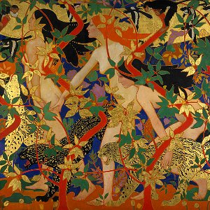

[Cloudscape #5: August 2010](http://www.mixcloud.com/eveningoflight/cloudscape-5-august-2010/?utm_source=widget&utm_medium=web&utm_campaign=base_links&utm_term=resource_link) by [Evening Of Light](http://www.mixcloud.com/eveningoflight/?utm_source=widget&utm_medium=web&utm_campaign=base_links&utm_term=profile_link) on [Mixcloud](http://www.mixcloud.com/?utm_source=widget&utm_medium=web&utm_campaign=base_links&utm_term=homepage_link)

 00:00 | novemthree | Ashes | [From These Ashes](http://www.eveningoflight.nl/2010/09/06/review-novemthree-from-these-ashes-2010/ "Review: novemthree – “From These Ashes..” (2010)") | 2010 05:55 | Nihil Project | Weaving Wheat | Plough Plays | 2006 10:44 | Twelve Thousand Days | All in the May | The Devil in the Grain | 2001 13:12 | Locrian | Between Barrows | Territories | 2010 18:58 | Maarten van der Vleuten | Thymatron DG | ECT for Piano | 2009 22:14 | The Gray Field Recordings | Stars Fall to Earth | [Hypnagogia](http://www.eveningoflight.nl/2006/10/02/review-the-gray-field-recordings-hypnagogia-2005/ "Review: The Gray Field Recordings – Hypnagogia (2005)") | 2005 25:15 | English Heretic | Don't Let Them Immanentise the Eschaton | 2006 Annual | 2006 26:53 | Von Thronstahl | Sturmzeit \[Schachmatt Mix\] | Conscriptum | 2010 29:55 | Kris Force / Jarboe | Woodsman Wolf | [The Path](http://www.eveningoflight.nl/2010/07/16/review-force-jarboe-present-the-path-2010/ "Review: Force / Jarboe present The Path (2010)") | 2010 32:50 | Visions | In the Midst of Infinity | Summoning the Void | 2010 42:00 | Children of the Stones | Fog on the Womb Road | [The Bright Day Is Gone](http://www.eveningoflight.nl/2007/10/01/review-children-of-the-stones-the-bright-day-is-gone-2006/ "Review: Children of the Stones – The Bright Day Is Gone (2006)") | 2006 48:28 | Duo Noir | Recessional | [Sintra](http://www.eveningoflight.nl/2010/09/23/review-duo-noir-sintra-2010/ "Review: Duo Noir – Sintra (2010)") | 2010 55:28 | Primordial | Hosting of the Sidhe | Storm Before Calm | 2002
