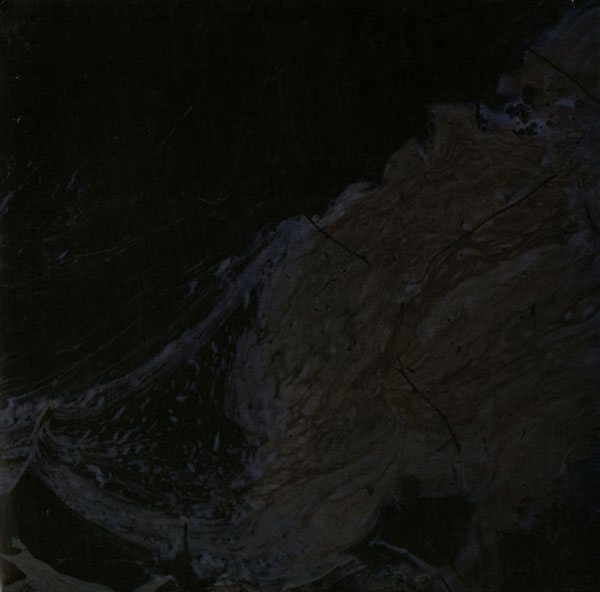

artist: **Locrian** release: _Territories_ format: LP year of release: 2010 label: [At War With False Noise](http://www.discogs.com/label/At+War+With+False+Noise), [Basses Frequences](http://www.discogs.com/label/Basses+Frequences), [BloodLust!](http://www.discogs.com/label/BloodLust%21), [Small Doses](http://www.discogs.com/label/Small+Doses) duration: 47:47

detailed info: [discogs.com](http://www.discogs.com/Locrian-Territories/release/2153397)

**Locrian**'s discography keeps growing at a steady pace, and with releases like this year's _Territories_ filling up the ranks, that is nothing to be ashamed of. The solid base of tearing guitars, drones, subtle synths and screeching noise is still here, but this time around, **Andre Foisy** and **Terrence Hannum** are joined by a variety of guest musicians, adding drums and other elements into the dystopian music.

"Inverted Ruins" starts off slow, with plodding drums and ear-piercing high frequencies accompanying slowly descending chords and raw, dirty vocals. "Between Barrows" is a subtle layered ambient piece with organs and cymbal swells. The A-side closes with a short noisy guitar soundscape that morphs into a raw black metal track, opening new vistas for the band.

The second half of the album has a similar curve, with "Ring Road" and "Antediluvian Territory" exploring melodies and drones, and the excellent final track, bringing more black metal after an otherworldly dual-guitar intro, and ending with some great melodic guitar leads over slower drums.

This _Territories_ LP is yet another example of the fascinating music of **Locrian**. It's not quite metal, not quite ambient, but something in its own right: urban, industrial, raw, visionary, and dystopian. Genre-crossing music for the 21st century.

Reviewed by **O.S.**

Tracklist:

I. Inverted Ruins (8:35) II. Between Barrows (5:54) III. Procession Of Ancestral Brutalism (10:48)

IV. Ring Road (9:41) V. Antediluvian Territory (4:02) VI. The Columnless Arcade (8:50)
