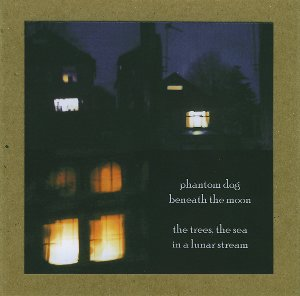

artist: **Phantom Dog Beneath the Moon** release: _The Trees, The Sea in a Lunar Stream_ format: CD year of release: 2010 label: [Rusted Rail](http://www.rustedrail.com/) duration: 49:55

detailed info: [discogs.com](http://www.discogs.com/Phantom-Dog-Beneath-The-Moon-The-Treesm-The-Sea-In-A-Lunar-Stream/release/2323037)

It's been six years since the release of the first album by **Phantom Dog Beneath the Moon** on **Deserted Village** in 2004. There is little surprise for me that this follow up charts a significant growth in the project's music. The recruitment of **Scott McLaughlin** as a permanent second band member has certainly contributed to this, as the ghostly and dark singer/songwriter folk has been enriched with a broader instrumentarium and more varied compositions.

This is showcased perfectly in the first four tracks. "As Perceived by Mice" lays a nice flowing base with piano and guitar, and **Aaron Hurley**'s trademark high voice, still pleasantly reminiscent of **Thom Yorke** here and there. The beautiful "Poems" is very intimate and subtle, weaving soft guitar lines with swooping cello and delicate touches of glockenspiel and music box. "Stealing Owls" and "Hide and Seek" introduce **Barry Hurley** on drums, lending these tracks a stronger rhythmic touch, bordering on subtle psych rock here and there, particularly in the last track's harpsichord sections.

The second half of the album holds more good things; The fifth and seventh track are simple and stylish guitar songs in the band's original vein, while "A Shimmering Clown" is a darkly beautiful soundscape with distant, sorrowful vocals. The closer, "Halloween", is equally excellent, with a superb development and crashing rock ending.

The edges are rough, which can be expected from an underground project like this. But look past that, and you've got a beautiful, honest and highly original album, lovingly released and handmade by **Rusted Rail**. Another gem from Ireland, highly recommended to dark folk lovers.

Reviewed by **O.S.**

Tracklist:

1\. As Perceived By Mice (5:17) 2. Poems (6:28) 3. Stealing Owls (5:51) 4. Hide And Seek (6:29) 5. Ellipse Of A Forest Walk (3:38) 6. A Shimmering Clown (7:29) 7. Two Hours After Dusk (5:37) 8. Halloween (9:06)
