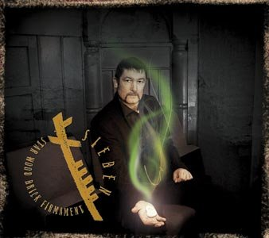

artist: **Sieben** release: _Star Wood Brick Firmament_ format: CD year of release: 2010 label: [Redroom](http://www.matthowden.com/) duration: 49:42

detailed info: [discogs.com](http://www.discogs.com/Sieben-Star-Wood-Brick-Firmament/release/2290958)

It was a mere matter of time before the rising star of **Sieben**'s oeuvre would be crowned by a new full-length album. Last year's _As They Should Sound_ saw **Matt Howden** looking to his back catalogue and restyling a selection of songs in a more current mode. Basically, _Star Wood Brick Firmament_ works in that same mode: Howden unaccompanied and without frills, but with a series of brand new tracks.

Opener "Minack Theatre" and the beautiful "Build You a Song" show Howden at his most subtle: soft, flowing violin soundscapes with minimal looped percussion (also violin), and his still extremely pleasant and natural voice. But there is an excellent balance on this album as well, with tracks like "Long Live the Post Romantic Empire" and "We Wait for Them" emphasising once more how adept Howden is at constructing catchy up-tempo rhythms and song lines.

In this respect, _Star Wood Brick Firmament_ is an excellent album, the **Sieben** sound more refined than ever. It is a sight better than the merely decent _Desire Rites_. Nevertheless, the strictly solo approach of the last two releases starts to rub against its borders here and there, and I can't help but want to hear some guest artist or other in some spots, as on albums like _Ogham Inside the Night_ and _High Broad Field_ and some recent live appearances. The two remixes tacked on to this album, courtesy of **Dark-hearted**, are nice, but do little to alleviate this, and it wouldn't have been a disaster either to've just ended the album with the incredibly catchy "Can't Stop This", maybe the closest Howden has ever got to a club hit.

Notwithstanding small gripes, this is yet another solid album by **Sieben**, arguably the best since _High Broad Field_. As such, it's an essential buy for any fan of Howden's work, and well worth checking out for everyone else as well, especially if you've got a soft spot for experimental folk with catchy songwriting.

Reviewed by **O.S.**

Tracklist:

1\. Minack Theatre (3:58) 2. Sweet Enough? (4:03) 3. Build You A Song (4:43) 4. Long Live The Post Romantic Empire (5:13) 5. We Wait For Them (3:43) 6. Donald (4:08) 7. Crowhurst (4:26) 8. Floating (3:52) 9. Jack In The Pulpit (3:25) 10. Can't Stop This (4:07) 11. There (Dark-hearted) (3:53) 12. We Wait (Dark-hearted) (4:11)
