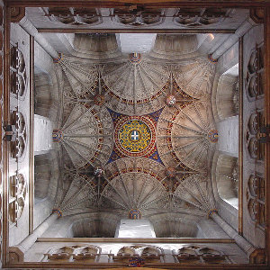

[Cloudscape #6: September 2010 Ambient Special](http://www.mixcloud.com/eveningoflight/cloudscape-6-september-2010-ambient-special/?utm_source=widget&utm_medium=web&utm_campaign=base_links&utm_term=resource_link) by [Evening Of Light](http://www.mixcloud.com/eveningoflight/?utm_source=widget&utm_medium=web&utm_campaign=base_links&utm_term=profile_link) on [Mixcloud](http://www.mixcloud.com/?utm_source=widget&utm_medium=web&utm_campaign=base_links&utm_term=homepage_link)

00:00 | Raison d'Être | The Verge of Somnolence | The Absolute Supper | 1997 06:27 | Ruhr Hunter | Knowledge To Know Is Eye | Torn of This | 2002 12:25 | Mystified | Soul in Motion | [Passing Through the Outer Gates](http://www.eveningoflight.nl/2011/01/27/review-mystified-passing-through-the-outer-gates-2010/ "Review: Mystified – Passing Through the Outer Gates (2010)") | 2010 17:22 | AUN | Shining | [Black Pyramid](http://www.eveningoflight.nl/2010/09/28/review-aun-black-pyramid-2010/ "Review: AUN – Black Pyramid (2010)") | 2010 26:12 | Martyn Bates & Troum | To a Child Dancing in the Wind | [To a Child Dancing in the Wind](http://www.eveningoflight.nl/2007/03/01/review-martyn-bates-troum-to-a-child-dancing-in-the-wind-2006/ "Review: Martyn Bates | Troum – To a Child Dancing in the Wind (2006)") | 2006 30:10 | Allseits | Hel | [Hel](http://www.eveningoflight.nl/2009/12/20/review-allseits-hel-2009/ "Review: Allseits – Hel (2009)") | 2009 36:08 | Coil | An Emergency | Musick To Play in the Dark, Vol. 2 | 2000 37:20 | Alphane Moon | Where the Hazel Grows | [John Barleycorn Reborn](http://www.eveningoflight.nl/2007/11/01/review-john-barleycorn-reborn-2007/ "Review: V.A. – John Barleycorn Reborn (2007)") | 2007 41:05 | Tangerine Dream | Sequent 'C' | Phaedra | 1974 43:00 | Current 93 | Twilight Twilight Nihil Nihil | All the Pretty Little Horses | 1996 50:10 | Agitated Radio Pilot | The Barren Ground Assembly | Your Turn To Go it Alone | 2006
