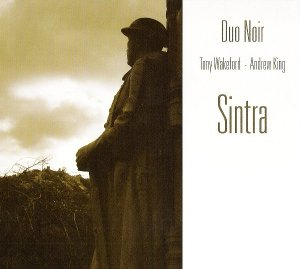

artist: **Duo Noir** release: _Sintra_ format: CD year of release: 2010 label: [TURSA](http://www.tursa.com/) duration: 71:57

detailed info: [discogs.com](http://www.discogs.com/Duo-Noir-Sintra/release/2290965)

Anyone who has seen **Sol Invictus** live during the past years will have noted the chemistry between **Tony Wakeford** and **Andrew King**. The style and repertoire of these men complement each other marvellously, and they've apparently come to the same conclusion, staging shows as a duo in addition to the full band experience of Sol Invictus. Their concert in Sintra of 14th November 2009 was recorded and now released as a limited live album on **TURSA**.

The twenty tracks on _Sintra_ prove to be a very representative document of these live shows and indeed of their whole collective oeuvre. There are obviously lots of Sol Invictus tracks here, but we also hear **The Triple Tree**, **Orchestra Noir**, and both men's solo material. The overall tenor of this album is of course neofolk, with its powerful vocals, militaristic drums, and acoustic guitar. However, there is room for other things, such as the neoclassical "The Last Train" and the more traditional renditions of ballads and poems.

A personal selection of favourites includes "The Cruellest Month", I presume the title track off the coming Sol Invictus album, brooding and dark; also "Black Crusade", "Eve", "Blackleg Miner", and especially the trio of **Rudyard Kipling**'s poems, sung by King: "Have You News of My Boy Jack", "Gethsemane", and "Recessional". Particularly the last one, with its orchestral samples and solemn delivery, is a new highlight in King's repertoire.

The strength of this show lies therefore not only in the reliable delivery of these two hardened folk artists, for that's what they've become, but also in the selection of tracks, which is very diverse and sure to delight newcomers and longstanding fans alike. Very much worth your attention.

Reviewed by **O.S.**

Tracklist:

1\. We Are The Dead Men (2:20) 2. An English Garden (4:10) 3. Edward (2:58) 4. Eve (2:06) 5. The Last Train (2:39) 6. Worcester City (5:43) 7. Night Forever (3:37) 8. Black Crusade (3:54) 9. Twa Corbies (2:49) 10. Death's Head (2:35) 11. The Wild Wild Berry (5:11) 12. Holy Water (3:28) 13. Blackleg Miner (3:14) 14. The Cruellest Month (3:08) 15. Have You News Of My Boy Jack (2:27) 16. Gethsemane (3:34) 17. Recessional (7:14) 18. Down The Road Slowly (4:31) 19. All Alone In Her Nirvana (2:46) 20. Angels Fall (3:33)
