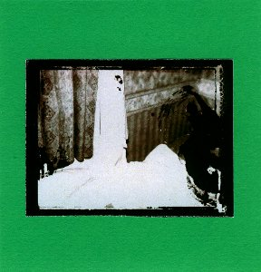

With five releases in two years to their name, and counting, **The Driftwood Manor** are one of Ireland's most prolific artists in the experimental folk scene. The band is centered around singer, songwriter, and guitarist **Eddie Keenan**, who enlists a cast of supporting musicians that varies with each release. The first two releases, [_A Gathering_](http://www.eveningoflight.nl/2009/02/01/review-the-driftwood-manor-a-gathering-2008/) and [_Every Light Goes Out Eventually_](http://www.eveningoflight.nl/2010/03/01/review-the-driftwood-manor-every-light-goes-out-eventually-2009/), were covered separately on Evening of Light, but 2010's releases have followed each other so quickly that a one-piece feature might suit these albums just as well as three separate reviews.

The crucial question when a band puts out three releases in one year is whether it's all any good. Thankfully, the answer so far for The Driftwood Manor is a simple resounding yes. Judging from the nearly twenty tracks on these offerings, the well of songs has not run dry in the least, and I expect we can look forward to more interesting material in the near future.

As a brief introduction, let me return to _A Gathering_, the first album, which held nine tracks clocking in at about 30 minutes. That album had a slightly poppy folk sound, some rock influences, but also an experimental touch to it and a hefty dose of melancholy, on the whole quite accessible as a modern folk album. The second release, though, 2009's EP _Every Light Goes Out Eventually_, was a profoundly sad duo of long mantra-like soundscapes, meditating on death and loss, capped by the brief and beautiful vocal ending of "Before it Is Time". With this release, which came as a pleasant surprise to me, Keenan and his band showed that they had at least one leg firmly rooted in the experimental music world.

\[caption id="attachment\_1326" align="aligncenter" width="135" caption="The Same Figure, Leaving"\]\[/caption\]

This delightful diversity continues with this year's albums, starting with the second full-length _The Same Figure, Leaving_, released in handmade packaging on French label [**Ruralfaune**](http://www.myspace.com/disquesruralfaune). The album marks a return to the folk songs of the first one, though with slightly less rock/pop leanings. A bit of an Americana sound is thrown into the mix as well, something which suits the general sound of the band admirably. The focus is once more of Keenan's voice and guitar, with excellent support by **Neil Fitzgibbon** on fiddle and **Bean Dolan** on double bass, among others. "A Coat Against the Winter", the opener, is a wonderful example of the band's introspective and melancholic sound and lyrical leanings:

_"We can have another whiskey / Before we step into the outside / As a coat against the winter / Like a word against the silence"_

Another highlight is the swinging mandolin-based "The Lasting Final Hurt", featuring perfect support work from Fitzgibbon's fiddle and **Audrey Ryan** on backing vocals. A final mention goes to the closing and title track, a wonderful ode to calm acceptance, where most if not all of the players on this album come together, particularly in the layered choruses of Keenan, **Anne Marie Hynes**, and for this one also **Dave Colohan**.

\[caption id="attachment\_1327" align="aligncenter" width="144" caption="Holy Ghost"\]\[/caption\]

We move on to _Holy Ghost_, the second EP, released as part of the 3" series by [**Rusted Rail**](http://www.rustedrail.com/). This time around we get six tracks, pretty much in the same style as The Same Figure, Leaving, but all with a power of their own. Therein lies the strength of Keenan's songwriting: the ability to come up with quite a number of songs in a coherent style that manage to be good enough in their own right to command the listener's attention. Particular attention must go to the superb "Bury Me Alive", a song with a strong dose of ballad and spiritual influence, sounding like it could come straight from some countryside church in the American (or Irish?) outback. But really, all the other stracks are simply strong as well; _Holy Ghost_ is solid until the end.

\[caption id="attachment\_1328" align="aligncenter" width="150" caption="Found Photographs of Ancestors"\]\[/caption\]

The final release is the EP _Found Photographs of Ancestors_, released in August 2010 by [**Apollolaan Recordings**](http://apollolaan.blogspot.com/). This handmade affair, limited to 50 copies, is a sequel to _Every Light Goes Out Eventually_, again combining drones, folk and some eastern musical influences. Keenan works with Colohan as a duo here, both very skilled by now in creating captivating experimental soundscapes. Apparently, these EPs are going to form a trilogy, with the third instalment still upcoming. I must say I found the first part just a tad more involving than this one, but this is still a fine piece of folky drone, and I eagerly await the final part of the trilogy.

So far, 2010 has brought us three fine releases from this Irish group, so I sincerely recommend them for anyone who is interested in alternative and experimental folk. Some of these might be sold out by now, as they've appeared in limited editions, but they might be available through mailorders still.
